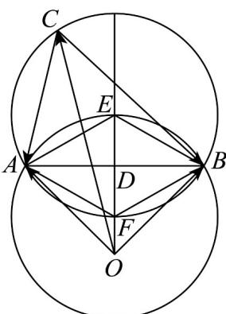

> [!faq]- 《专题06 平面向量的应用（高效培优期中专项训练）数学人教A版高一必修第二册》官方解析
>
> > [!success]- **【答案】** $\frac{\sqrt{2}+\sqrt{6}}{2}$ ;
>
> > [!note]- **【解析】**
> > 如图，设 $OA = aQB = bQC = c$ ，由题可得 $\angle AOB = \frac{\pi}{2}$ ， $AB = \sqrt{2}$
> >
> > 取 $AB$ 中点为 $D$ ，过 $D$ 做 $AB$ 垂线，在垂线上取点 $E$ ， $F$ ，使 $DE = DF = \frac{\sqrt{2}}{2\sqrt{3}} = \frac{\sqrt{6}}{6}$
> >
> > 从而可使 $\angle AEB = \angle AFB = 120^{\circ}$ ，再以 $E$ ， $F$ 为圆心， $AE = AF = \frac{\sqrt{6}}{3}$ 为半径作圆，
> >
> > 则当一点 G 分别在两圆优弧 AB 上时， $\angle AGB = 60^{\circ}$
> >
> > 注意到 $a - c = \overline{CA}, b - c = \overline{CB}$ ，则 $a - c, b - c = \angle ACB$ ，即 $c$ 终点 $C$ 在两圆优弧 $\overline{AB}$ 上。
> >
> > 由图可得，当 C 在圆 E 优弧 AB 上，且 C, E, O 三点共线时 $\left|c\right|$ 最大.
> >
> > 则 $\left|\vec{c}\right|\leq AE+ED+OD=\frac{\sqrt{6}}{3}+\frac{\sqrt{6}}{6}+\frac{\sqrt{2}}{2}=\frac{\sqrt{2}+\sqrt{6}}{2}$
> >
> > 故答案为： $\frac{\sqrt{2}+\sqrt{6}}{2}$
> >
> > 
