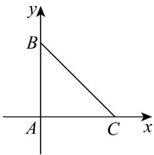

> [!faq]- 《专题06 平面向量的应用（高效培优期中专项训练）数学人教A版高一必修第二册》官方解析
>
> > [!success]- **【答案】** A
>
> > [!note]- **【解析】**
> > 由 $\left|CB-CA\right|=\left|BC-BA\right|$ 可得 $\left|AB\right|=\left|AC\right|$
> >
> > 又因为 $\overline{AB} \cdot \overline{AC} = 0$ ， $\left|\overline{BC}\right| = 6$ ，所以 $\left|\overline{AB}\right| = \left|\overline{AC}\right| = 3\sqrt{2}$
> >
> > 建立如图所示的平面直角坐标系，可得 $C(3\sqrt{2},0),B(0,3\sqrt{2}),A(0,0)$
> >
> > 所以 $AB = (0, 3\sqrt{2})$ ， $BC = (3\sqrt{2}, -3\sqrt{2})$
> >
> > $$
> > m A B - \frac {1}{3} B C = (- \sqrt {2}, 3 \sqrt {2} m + \sqrt {2}), m A B - \frac {1}{2} B C = \left(- \frac {3 \sqrt {2}}{2}, 3 \sqrt {2} m + \frac {3 \sqrt {2}}{2}\right)
> > $$
> >
> > 所以 $\left|mAB - \frac{1}{3} BC\right| + \left|mAB - \frac{1}{2} BC\right| = \sqrt{\left(-\sqrt{2}\right)^2 + \left(3\sqrt{2}m + \sqrt{2}\right)^2} +\sqrt{\left(-\frac{3\sqrt{2}}{2}\right)^2 + \left(3\sqrt{2}m + \frac{3\sqrt{2}}{2}\right)^2}$
> >
> > $$
> > = \sqrt {\left(3 \sqrt {2} m + \sqrt {2}\right) ^ {2} + \left(- \sqrt {2}\right) ^ {2}} + \sqrt {\left(3 \sqrt {2} m + \frac {3 \sqrt {2}}{2}\right) ^ {2} + \left(- \frac {3 \sqrt {2}}{2}\right) ^ {2}}
> > $$
> >
> > 表示 $x$ 轴上一点 $M(3\sqrt{2} m,0)$ 到 $E(-\sqrt{2},\sqrt{2})$ 和 $F\left(-\frac{3\sqrt{2}}{2},\frac{3\sqrt{2}}{2}\right)$ 的距离之和，
> >
> > 所以求 $\left|mAB-\frac{1}{3}BC\right|+\left|mAB-\frac{1}{2}BC\right|$ 即 $|ME|+|MF|$ ，
> >
> > $E\left(-\sqrt{2},\sqrt{2}\right)$ 关于 $x$ 轴的对称点为 $E^{\prime}\left(-\sqrt{2}, - \sqrt{2}\right)$
> >
> > 所以 $\left|ME\right|=\left|ME'\right|$
> >
> > 所以 $\left|mAB-\frac{1}{3}BC\right|+\left|mAB-\frac{1}{2}BC\right|$ 的最小值为 $\left|E^{\prime}F\right|=\sqrt{\left(-\sqrt{2}+\frac{3\sqrt{2}}{2}\right)^{2}+\left(-\sqrt{2}-\frac{3\sqrt{2}}{2}\right)^{2}}=\sqrt{13}$
> >
> > 
> >
> > 故选 **A**.
