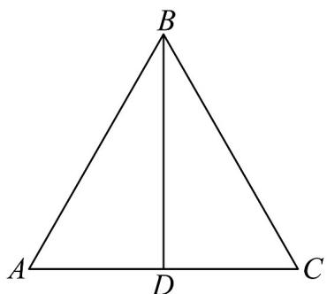

> [!faq]- 《专题06 平面向量的应用（高效培优期中专项训练）数学人教A版高一必修第二册》官方解析
>
> > [!success]- **【答案】** A. 等边三角形 B. 等腰非等边三角形 C. 直角三角形 D. 等腰直角三角形
>
> > [!note]- **【解析】**
> > 若 $D$ 是 $AC$ 的中点，则 $\overline{BD} = \frac{1}{2}\left(\overline{BA} +\overline{BC}\right)$ ，故 $\left(\overline{BA} +\overline{BC}\right)\cdot \overline{AC} = 2\overline{BD}\cdot \overline{AC} = 0$ 所以 $BD\bot AC$ ，显然VABC为等腰三角形，即 $BA = BC$ 由 $\left|\frac{\overline{AB}}{|AB|} +\frac{\overline{AC}}{|AC|}\right| = \sqrt{\left(\frac{\overline{AB}}{|AB|} +\frac{\overline{AC}}{|AC|}\right)^2} = \sqrt{1 + 2\cos A + 1} = \sqrt{3}$ ，可得 $\cos A = \frac{1}{2}$
> >
> > 又 $0 < A < \pi$ ，故 $A = \frac{\pi}{3}$ ，故VABC为等边三角形
> >
> > 故选：A
> >
> > 
