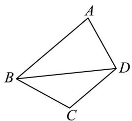

<!-- question-source:start -->
39. 如图．在平面四边形 $ABCD$ 中， $BC = CD = AD = \frac{\sqrt{3}}{3} AB$

(1) 设 $\angle CBD = \theta$ ，证明 $\frac{\cos A}{\sin^{2}\theta}$ 为定值。

(2) 若 $BC = 1$ ，记 $\triangle ABD$ 的面积为 $S_{1}$ ， $\triangle BCD$ 的面积为 $S_{2}$ 。 $S = 2S_{1}^{2} + S_{2}^{2}$ ，求 $S$ 的最大值。
<!-- question-source:end -->

![[高中/课堂同步/题库/人教A版高中数学同步讲义(2026)/02_必修第二册/期中专项训练+期中模拟卷/专题07 正弦定理、余弦定理（高效培优期中专项训练）数学人教A版高一必修第二册/专题07_正弦定理_余弦定理/questions/answers/Q00077027A1.md]]
