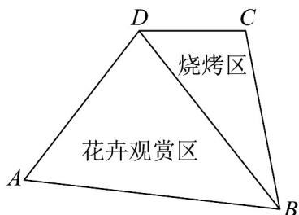

<!-- question-source:start -->
56. 某公园拟建造一个四边形的露营基地，如图 $ABCD$ 所示。为考虑露营客人娱乐休闲的需求，在四边形 $ABCD$ 区域中，将三角形 $ABD$ 区域设立成花卉观赏区，三角形 $BCD$ 区域设立成烧烤区，边 $AB, BC, CD, DA$ 修建观赏步道，边 $BD$ 修建隔离防护栏，其中 $CD = 100$ 米， $BC = 200$ 米， $\angle A = \frac{\pi}{3}$ 。

(1)若 $BD = 250$ 米，求角 $C$ 的余弦值；

(2)如果烧烤区是一个占地面积为 $9600$ 平方米的钝角三角形，那么需要修建多长的隔离防护栏（精确到0.1米）？

(3)考虑到烧烤区的安全性，在规划四边形ABCD区域时，首先保证烧烤区的占地面积最大时，再使得花卉观赏区的面积尽可能大，则应如何设计观赏步道？
<!-- question-source:end -->

![[高中/课堂同步/题库/人教A版高中数学同步讲义(2026)/02_必修第二册/期中专项训练+期中模拟卷/专题07 正弦定理、余弦定理（高效培优期中专项训练）数学人教A版高一必修第二册/专题07_正弦定理_余弦定理/questions/answers/Q00077037A1.md]]
