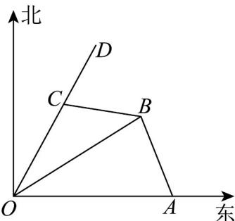

<!-- question-source:start -->
60. 如图，一艘货轮从码头 $O$ 出发沿北偏东 $30^{\circ}$ 的 $OD$ 方向以 $20$ 海里/小时的速度驶往目的地，出发后发现燃料不足，立即联系位于 $O$ 正东方向 $120$ 海里的 $A$ 处的加油船在中途加油补充燃料，假设加油船与货轮同时出发，但加油船要先到小岛 $B$ 处补给物资再赶往货轮处，已知小岛 $B$ 在码头 $O$ 北偏东 $60^{\circ}$ 方向，也在 $A$ 北偏西 $30^{\circ}$ 方向上，加油船在 $B$ 处补给物资需要 $1$ 个小时，且加油船航行速度始终为 $60$ 海里/小时。

(1)求加油船到达小岛 B 所需的时间；

(2)两艘船最少经过多少小时能相遇？
<!-- question-source:end -->

![[高中/课堂同步/题库/人教A版高中数学同步讲义(2026)/02_必修第二册/期中专项训练+期中模拟卷/专题07 正弦定理、余弦定理（高效培优期中专项训练）数学人教A版高一必修第二册/专题07_正弦定理_余弦定理/questions/answers/Q00077041A1.md]]
