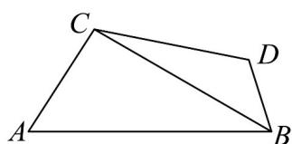

> [!faq]- 《专题07 正弦定理、余弦定理（高效培优期中专项训练）数学人教A版高一必修第二册》官方解析
>
> > [!success]- **【答案】**  A. 1 B. $\sqrt{3}$ C. 2 D. $\sqrt{5}$
>
> > [!note]- **【解析】**
> > 在 $\forall ABC$ 中， $AB = 2\sqrt{7}, \angle ABC = 30^{\circ}, AC \perp CB$
> >
> > 可得 $BC = AB \cos \angle ABC = 2\sqrt{7} \times \frac{\sqrt{3}}{2} = \sqrt{21}$ ，
> >
> > 在 $\triangle BCD$ 中， $CD = 4,\angle BDC = 120^{\circ},BC = \sqrt{21}$
> >
> > 由余弦定理可得 $BC^{2} = CD^{2} + BD^{2} - 2CD\cdot BD\cos \angle BDC$
> >
> > 即 $21 = 16 + BD^{2} - 2 \times 4BD \times \left(-\frac{1}{2}\right)$
> >
> > 即 $BD^{2} + 4BD - 5 = 0$ ，解得 $BD = 1$ （负值已舍）.
> >
> > 即 $BD$ 的长度为 1 .
> >
> > 故选 **A**.
