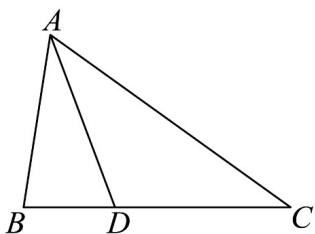

> [!faq]- 《专题07 正弦定理、余弦定理（高效培优期中专项训练）数学人教A版高一必修第二册》官方解析
>
> > [!success]- **【答案】** A. $2\sqrt{3}$ B. 3 C. $2\sqrt{2}$ D. $\sqrt{3}$
>
> > [!note]- **【解析】**
> > 由余弦定理得 $b^{2}+c^{2}-a^{2}=2bc\cos A=\frac{4}{\tan A}$ ，则 $bc=\frac{2}{\sin A}$
> >
> > 由 $\overline{BD}=\frac{1}{2}\overline{DC}$ ，则 $\frac{BD}{DC}=\frac{1}{2}$
> >
> > 因为 $\angle A$ 的平分线交 BC 边于 D，
> >
> > 所以 $\frac{AB}{AC} = \frac{c}{b} = \frac{BD}{DC} = \frac{1}{2}$ ，则 $b = 2c$ ，
> >
> > 所以 $bc = 2c^{2} = \frac{2}{\sin A}$ ，则 $c = \frac{1}{\sqrt{\sin A}}$ ， $b = \frac{2}{\sqrt{\sin A}}$ ，
> >
> > 所以 $a^2 = b^2 + c^2 - 2bc\cos A = \frac{4}{\sin A} + \frac{1}{\sin A} - 2 \cdot \frac{2}{\sqrt{\sin A}} \cdot \frac{1}{\sqrt{\sin A}} \cdot \cos A$
> >
> > $$
> > = \frac {5 - 4 \cos A}{\sin A} = \frac {5 \left(\cos^ {2} \frac {A}{2} + \sin^ {2} \frac {A}{2}\right) - 4 \left(\cos^ {2} \frac {A}{2} - \sin^ {2} \frac {A}{2}\right)}{2 \sin \frac {A}{2} \cos \frac {A}{2}} = \frac {\cos^ {2} \frac {A}{2} + 9 \sin^ {2} \frac {A}{2}}{2 \sin \frac {A}{2} \cos \frac {A}{2}}
> > $$
> >
> > $$
> > = \frac {1 + 9 \tan^ {2} \frac {A}{2}}{2 \tan \frac {A}{2}} = \frac {1}{2 \tan \frac {A}{2}} + \frac {9 \tan \frac {A}{2}}{2} \quad 2 \sqrt {\frac {1}{2 \tan \frac {A}{2}} \cdot \frac {9 \tan \frac {A}{2}}{2}} = 3, \quad \tan \frac {A}{2} > 0,
> > $$
> >
> > 则 $\frac{1}{a\sqrt{3}}$ ，当且仅当 $\frac{1}{2\tan\frac{A}{2}} = \frac{9\tan\frac{A}{2}}{2}$ 即 $\tan \frac{A}{2} = \frac{1}{3}$ 时等号成立，
> >
> > 即 BC 的最小值为 $\sqrt{3}$ .
> >
> > 故选：D.
> >
> > 
