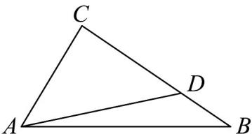

> [!faq]- 《专题07 正弦定理、余弦定理（高效培优期中专项训练）数学人教A版高一必修第二册》官方解析
>
> > [!success]- **【答案】** $^{(1)}$ 证明见解析 (2) $\sqrt{3}+1$
>
> > [!note]- **【解析】**
> > （1）由 $\frac{\sin C - \sin B}{\cos B + \cos A} = \frac{\cos B - \cos A}{\sin C}$ 可得， $(\sin C - \sin B)\sin C = (\cos B + \cos A)(\cos B - \cos A)$ ，
> >
> > 故 $\sin^2 C - \sin B\sin C = \cos^2 B - \cos^2 A$ ，即 $\sin^2 C - \sin B\sin C = 1 - \sin^2 B - (1 - \sin^2 A)$
> >
> > 由正弦定理得 $c^2 + b^2 - a^2 = bc$ ，故 $\cos A = \frac{c^2 + b^2 - a^2}{2bc} = \frac{1}{2}$ ，
> >
> > $0 < A < \pi$ ，所以 $A = \frac{\pi}{3}$ ， $S_{\mathrm{VABC}} = \frac{1}{2} bc\sin A = \frac{\sqrt{3}}{6} c^2$ ，所以 $2c = 3b$
> >
> > 故 $AD = AB + BD = \frac{2}{3} AB + \frac{1}{3} AC$
> >
> > 所以 $\left|\frac{\square\square\square}{AD}\right|=\frac{\frac{1}{3}\left|2AB+AC\right|}{\frac{1}{3}\left|AC-AB\right|}=\frac{\sqrt{4c^{2}+2bc+b^{2}}}{\sqrt{b^{2}-bc+c^{2}}}=\sqrt{\frac{\left(\frac{b}{c}\right)^{2}+\frac{2b}{c}+4}{\left(\frac{b}{c}\right)^{2}-\frac{b}{c}+1}}$
> >
> > $$
> > \frac {b}{c} = t > 0
> > $$
> >
> > $$
> > \frac {\left| \begin{array}{c} A D \\ B D \end{array} \right|}{\left| \begin{array}{c} B D \end{array} \right|} = \frac {\sqrt {t ^ {2} + 2 t + 4}}{\sqrt {t ^ {2} - t + 1}} = \sqrt {1 + \frac {3 (t + 1)}{t ^ {2} - t + 1}} = \sqrt {1 + \frac {3 (t + 1)}{(t + 1) ^ {2} - 3 (t + 1) + 3}}
> > $$
> >
> > $$
> > = \sqrt {1 + \frac {3}{(t + 1) + \frac {3}{t + 1} - 3}} \leq \sqrt {1 + \frac {3}{2 \sqrt {3} - 3}} = \sqrt {4 + 2 \sqrt {3}} = \sqrt {3} + 1
> > $$
> >
> > 当且仅当 $t = \sqrt{3} - 1$ 取等号，所以 $\frac{|A|D}{|BD|}$ 的最大值为 $\sqrt{3} + 1$
> >
> > 
