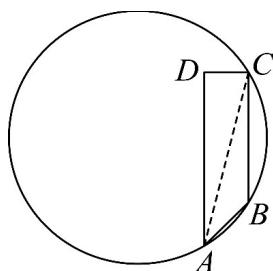

> [!faq]- 《专题07 正弦定理、余弦定理（高效培优期中专项训练）数学人教A版高一必修第二册》官方解析
>
> > [!success]- **【答案】** A. $\frac{13}{2}\pi$ B. $\frac{17}{2}\pi$ C. $9\pi$ D. $\frac{5}{4}\pi$
>
> > [!note]- **【解析】**
> > 连接 AC，
> >
> > 因为 $AD \perp CD, AD = 4, CD = 1$ ，所以 $AC = \sqrt{17}$ ，
> >
> > $\cos \angle ACB = \frac{17 + 9 - 2}{2\sqrt{17} \times 3} = \frac{4\sqrt{17}}{17}$ ,
> >
> > 所以 $\sin \angle ACB = \sqrt{1 - \left(\frac{4\sqrt{17}}{17}\right)^2} = \frac{\sqrt{17}}{17}$
> >
> > 
> >
> > 由题意该圆即为三角形 ABC 的外接圆，
> >
> > 设该圆的半径为 R，则 $2R = \frac{AB}{\sin \angle ACB} = \frac{\sqrt{2}}{\frac{1}{\sqrt{17}}} = \sqrt{34}$ ，
> >
> > 所以该圆的面积为 $\pi R^2 = \pi \left(\frac{\sqrt{34}}{2}\right)^2 = \frac{17}{2}\pi$
> >
> > 故选 **B**.
