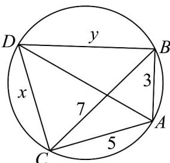

> [!faq]- 《专题07 正弦定理、余弦定理（高效培优期中专项训练）数学人教A版高一必修第二册》官方解析
>
> > [!success]- **【答案】** $\pi$
>
> > [!note]- **【解析】**
> > 在 $\forall ABC$ 中， $A \in (0, \pi)$ ，则 $\sin A \neq 0$
> >
> > 由题意得 $c \cos B + b \cos C - 2a \sin A = 0$
> >
> > 则由正弦定理得 $\sin C \cos B + \sin B \cos C = 2 \sin^{2} A$
> >
> > 由两角和的正弦公式得 $\sin (B + C) = 2\sin^2 A$
> >
> > 由诱导公式得 $\sin A = 2\sin^{2}A$ ，即 $\sin A = \frac{1}{2}$ ，
> >
> > 设VABC 外接圆的半径为 R，且 a = 1
> >
> > 由正弦定理得 $2R=\frac{1}{\frac{1}{2}}$ ，解得 R=1，
> >
> > 由圆的面积公式得 $\bigvee ABC$ 外接圆面积为 $\pi \times 1^{2} = \pi$ .
> >
> > 故答案为： $\pi$
> >
> > 28. 四边形 $ABCD$ 四个顶点在一个平面上， $\angle BAC = \frac{2\pi}{3}$ ， $\angle ABD = \angle ACD = \frac{\pi}{2}$ ， $AB = 3$ ， $AC = 5$ ，则 $AD$ 的值为（）A. $\frac{7\sqrt{3}}{3}$ B. $\frac{14\sqrt{3}}{3}$ C. 14 D. $\sqrt{34}$
> >
> > 【答案】B
> >
> > 【详解】设 $DC = x, DB = y$
> >
> > 
> >
> > 由题意 $\angle BAC = \frac{2\pi}{3}$ ， $\angle ABD = \angle ACD = \frac{\pi}{2}$ ，所以 $\angle BDC = \frac{\pi}{3}$
> >
> > 由余弦定理得 $x^{2} + y^{2} - xy = BC^{2} = 3^{2} + 5^{2} + 3\cdot 5 = 49$
> >
> > 由勾股定理有 $x^{2} + 25 = AD^{2} = y^{2} + 9$
> >
> > 从而将 $y^{2}=x^{2}+16$ 代入 $x^{2}+y^{2}-xy=49$ ，得 $y=\frac{2x^{2}-33}{x}>0\Rightarrow x^{2}>\frac{33}{2}$
> >
> > 将 $y = \frac{2x^2 - 33}{x} >0$ 代入 $y^{2} = x^{2} + 16$ ，得 $\left(2x^{2} - 33\right)^{2} = x^{4} + 16x^{2}$
> >
> > 即 $3x^{4} - 148x^{2} + 1089 = 0$ ，解得 $x^{2} = \frac{148\pm 94}{6} = \frac{121}{3}$ 或9（舍去），
> >
> > 所以 $AD = \sqrt{x^{2} + 25} = \sqrt{\frac{121}{3} + 25} = \frac{14\sqrt{3}}{3}$ .
> >
> > 故选 **B**.
