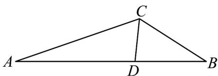

> [!faq]- 《专题07 正弦定理、余弦定理（高效培优期中专项训练）数学人教A版高一必修第二册》官方解析
>
> > [!success]- **【答案】** (1) $C=\frac{2\pi}{3}$ (2) (i) 证明见解析；(ii) $CD = \frac{6}{5}$
>
> > [!note]- **【解析】**
> > （1）由题设 $\frac{c - b}{a} = \frac{a + b}{c + b}$ ，则 $c^2 -b^2 = a^2 +ab$ ，故 $a^2 +b^2 -c^2 = -ab$
> >
> > 所以 $\cos C = \frac{a^2 + b^2 - c^2}{2ab} = -\frac{1}{2}$ ，又 $C \in (0, \pi)$ ，故 $C = \frac{2\pi}{3}$ .
> >
> > (2) (i) 由题设 $\angle ACD = \angle BCD$ ，若 $AB$ 上的高为 $h$ ，
> >
> > 又 $S_{\triangle ACD} = \frac{1}{2} AC\cdot CD\sin \angle ACD = \frac{1}{2} AD\cdot h$
> >
> > $$
> > S _ {\triangle B C D} = \frac {1}{2} B C \cdot C D \sin \angle B C D = \frac {1}{2} B D \cdot h
> > $$
> >
> > 所以 $\frac{S_{\triangle ACD}}{S_{\triangle BCD}} = \frac{\frac{1}{2} AC \cdot CD \sin \angle ACD}{\frac{1}{2} BC \cdot CD \sin \angle BCD} = \frac{\frac{1}{2} AD \cdot h}{\frac{1}{2} BD \cdot h}$ ，即 $\frac{AD}{BD} = \frac{AC}{BC}$
> >
> > 
> >
> > (ii) 由 $\frac{c}{\sin \angle ACB} = \frac{a}{\sin A}$ ，则 $\sin A = \frac{a \sin \angle ACB}{c} = \sqrt{\frac{3}{19}}$ ，又 $A$ 为锐角，故 $\cos A = \frac{4}{\sqrt{19}}$
> >
> > 若 $\frac{AD}{BD} = \frac{AC}{BC} = k$ ，则 $AC = 2k$ ，且 $AD = kBD$ ， $AD + BD = \sqrt{19}$
> >
> > 由余弦定理知： $\cos A = \frac{AC^2 + AB^2 - BC^2}{2AC\cdot AB} = \frac{4k^2 + 15}{4\sqrt{19}k} = \frac{4}{\sqrt{19}}$
> >
> > 所以 $4k^{2} - 16k + 15 = (2k - 3)(2k - 5) = 0$ ，可得 $k = \frac{3}{2}$ 或 $k = \frac{5}{2}$ 当 $k = \frac{3}{2}$ ，则 $AC = 3 < \sqrt{19}$ ， $AD = \frac{3\sqrt{19}}{5}$ ，此时 $\frac{AD}{\sin\angle ACD} = \frac{CD}{\sin A}$ ，则 $CD = \frac{6}{5}$ ；
> > 当 $k = \frac{5}{2}$ ，则 $AC = 5 > \sqrt{19}$ ，即 $\angle B > \angle ACB = \frac{2\pi}{3}$ ，不合题设；
> > 综上， $CD = \frac{6}{5}$ .
