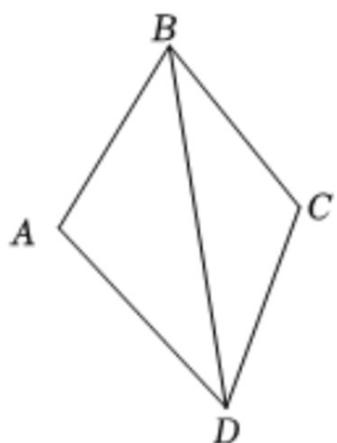

> [!faq]- 《专题07 正弦定理、余弦定理（高效培优期中专项训练）数学人教A版高一必修第二册》官方解析
>
> > [!success]- **【答案】** A. $B = \frac{\pi}{3}$ B. $\forall ABC$ 外接圆的面积为 $16\pi$ C. $\forall ABC$ 的面积的最大值为 $4\sqrt{3}$ D. $a + c$ 的最大值是 8
>
> > [!note]- **【解析】**
> > 对 $^{A}$ ：由 $a\cos C + c\cos A = 2b\cos B$ ，利用正弦定理，可得：
> >
> > $$
> > \sin A \cdot \cos C + \sin C \cdot \cos A = 2 \sin B \cdot \cos B \Rightarrow \sin (A + C) = 2 \sin B \cdot \cos B \Rightarrow \sin B = 2 \sin B \cdot \cos B.
> > $$
> >
> > 因为 $B \in (0, \pi)$ ，所以 $\sin B \neq 0$ ，所以 $\cos B = \frac{1}{2} \Rightarrow B = \frac{\pi}{3}$ ，故 $\mathbb{A}$ 正确；
> >
> > 对 $^{B}$ ：设 $\bigvee ABC$ 外接圆半径为 $_{R}$ ，则 $2R = \frac{b}{\sin B} = \frac{4}{\sin \frac{\pi}{3}} = \frac{8}{\sqrt{3}} \Rightarrow R = \frac{4\sqrt{3}}{3}$ ，
> >
> > 所以 $\vee ABC$ 外接圆面积为： $\pi R^2 = \frac{16}{3}\pi$ ，故B错误；
> >
> > 对 C：由余弦定理： $b^{2}=a^{2}+c^{2}-2ac\cos B\Rightarrow a^{2}+c^{2}-ac=16\Rightarrow16+ac=a^{2}+c^{2}\quad2ac$ ，所以 $ac\leq16$ ，当 a=b=4 时取等号·
> >
> > 所以 $S_{\triangle ABC} = \frac{1}{2} ac \sin B \leq \frac{1}{2} \times 16 \times \frac{\sqrt{3}}{2} = 4\sqrt{3}$ . 故 C 正确；
> >
> > 对 D：因为 $a^{2}+c^{2}-ac=16$ ，所以 $(a+c)^{2}-3ac=16$ 且 $ac\leq\frac{(a+c)^{2}}{4}$ ，
> >
> > 所以 $3ac = (a + c)^{2} - 16 \leq \frac{3}{4}(a + c)^{2} \Rightarrow (a + c)^{2} \leq 64 \Rightarrow a + c \leq 8$ 故 D 正确.
> >
> > 故选：ACD
> >
> > 44. “我将来要当一名麦田里的守望者，有那么一群孩子在一块麦田里玩，几千万的小孩子，附近没有一个大人，我是说……除了我”《麦田里的守望者》中的主人公霍尔顿将自己的精神生活寄托于那广阔无垠的麦田．假设霍尔顿在一块成凸四边形ABCD的麦田里成为守望者，如图所示，为了分割麦田，他将BD连接，设△ABD中边BD所对的角为A，△BCD中边BD所对的角为C，经测量知 $AB=BC=CD=2$ ， $AD=2\sqrt{3}$
> >
> > 
> >
> > (1)若 $A = 30^{\circ}$ ，求 $C$ ；
> >
> > (2)霍尔顿发现无论 $BD$ 多长， $\sqrt{3}\cos A - \cos C$ 为一个定值，请你验证霍尔顿的结论，并求出这个定值；
> >
> > (3)霍尔顿发现麦田的生长与土地面积的平方呈正相关，记 $\triangle ABD$ 与 $\triangle BCD$ 的面积分别为 $S_{1}$ 和 $S_{2}$ ，为了更好地规划麦田，请你帮助霍尔顿求出 $S_{1}^{2} + S_{2}^{2}$ 的最大值。
> >
> > 【答案】 $^{(1)}$ 答案见解析
> >
> > (2)验证见解析，1
> >
> > (3)14
> >
> > 【详解】（1）由 $AB = 2$ ， $AD = 2\sqrt{3}$ ∠ $A = 30^{\circ}$
> >
> > 在 $\triangle ABD$ 中，由余弦定理得 $BD^{2} = AB^{2} + AD^{2} - 2AB\cdot AD\cos A = 2^{2} + (2\sqrt{3})^{2} - 2\times 2\times 2\sqrt{3}\times \frac{\sqrt{3}}{2} = 4$
> >
> > 所以 BD = 2 ·
> >
> > 又 $BC = CD = 2$ ，所以 $\triangle BCD$ 是等边三角形，
> >
> > 所以 $\angle C = 60^{\circ}$
> >
> > (2) 在 $\triangle ABD$ 中，由余弦定理得
> >
> > $$
> > B D ^ {2} = A B ^ {2} + A D ^ {2} - 2 A B \cdot A D \cos A = 1 6 - 8 \sqrt {3} \cos A,
> > $$
> >
> > 在 $\triangle BCD$ 中，由余弦定理得 $BD^{2} = BC^{2} + CD^{2} - 2BC\cdot CD\cos C = 8 - 8\cos C$
> >
> > $$
> > \therefore 1 6 - 8 \sqrt {3} \cos A = 8 - 8 \cos C
> > $$
> >
> > 所以 $\sqrt{3}\cos A - \cos C = 1$ 为定值；
> >
> > (3) $S_{1} = \frac{1}{2} AB\cdot AD\sin A = 2\sqrt{3}\sin A,S_{2} = \frac{1}{2} BC\cdot DC\sin C = 2\sin C$
> >
> > 则 $S_{1}^{2} + S_{2}^{2} = 16 - \left(12\cos^{2}A + 4\cos^{2}C\right)$
> >
> > 由（2）知： $\sqrt{3}\cos A = \cos C + 1$ ，∴ $\sqrt{3}\cos A - 1 = \cos C$
> >
> > 代入上式得： $S_{1}^{2} + S_{2}^{2} = 16 - 12\cos^{2}A - 4\left(\sqrt{3}\cos A - 1\right)^{2} = -24\cos^{2}A + 8\sqrt{3}\cos A + 12.$
> >
> > 配方得： $S_{1}^{2} + S_{2}^{2} = -24\left(\cos A - \frac{\sqrt{3}}{6}\right)^{2} + 14$
> >
> > $$
> > \because C \in (0, \pi), \therefore - 1 <   \cos C <   1
> > $$
> >
> > 又 $\therefore \sqrt{3}\cos A - 1 = \cos C, \therefore \sqrt{3}\cos A = \cos C + 1 > 0$
> >
> > 所以当 $\cos A = \frac{\sqrt{3}}{6}$ 时， $S_1^2 + S_2^2$ 取到最大值 $^{14}$ .
