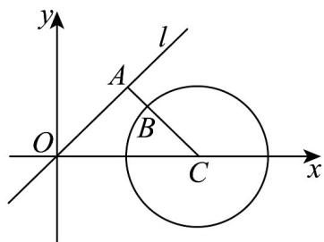

> [!faq]- 《专题08 复数的概念（高效培优期中专项训练）数学人教A版高一必修第二册》官方解析
>
> > [!success]- **【答案】** BD
>
> > [!note]- **【解析】**
> > 对 A：由题意得 $z_{1}=3+4i$ ， $z_{2}=2+5i$ ，
> >
> > 所以 $\left|z_{1}\right|=\sqrt{3^{2}+4^{2}}=5$ ， $\left|z_{2}\right|=\sqrt{2^{2}+5^{2}}=\sqrt{29}$ ，所以 $\left|z_{1}\right|\neq\left|z_{2}\right|$ ，
> >
> > 所以 $Z_{1}$ ， $Z_{2}$ 两点不在以原点为圆心的同一个圆上，故 $\mathsf{A}$ 错误；
> >
> > 对 B： $Z_{1}$ ， $Z_{2}$ 两点之间的距离为 $\left|Z_{1}Z_{2}\right|=\sqrt{(3-2)^{2}+(4-5)^{2}}=\sqrt{2}$ ，故 B 正确；
> >
> > 对 C：满足 $\left|z\right|=\left|z_{1}\right|=5$ 的复数 z 对应的点 Z 形成的图形是以原点为圆心，以 5 为半径的圆，所以其周长为 $2\pi\times5=10\pi$ ，故 C 错误；
> >
> > 对 $D$ ：满足 $\left|z_1\right| <   \left|z\right| <   \left|z_2\right|$ 的复数 $^Z$ 对应的点 $^Z$ 形成的图形是以原点为圆心，
> >
> > 分别以 $\sqrt{3^2 + 4^2} = 5$ ， $\sqrt{2^2 + 5^2} = \sqrt{29}$ 为半径的两个圆所夹的圆环，
> >
> > 所以其面积为 $\pi \times \left(\sqrt{29}\right)^2 -\pi \times 5^2 = 4\pi$ ，故D正确.
> >
> > 故选：BD.
> >
> > 34. 复数 $z_{1}$ , $z_{2}$ 满足 $\left|z_{1} - 1\right| = \left|\overline{z_{1}} + \mathrm{i}\right|$ , $\left|z_{2} - 2\right| = 1$ , 则 $\left|z_{1} - z_{2}\right|$ 的最小值为 \_\_\_\_.
> >
> > 【答案】 $\sqrt{2} - 1 / -1 + \sqrt{2}$
> >
> > 【详解】设 $z_{1} = x + y\mathrm{i},x,y\in \mathbb{R}$ ，则 $z_{1} = x - y\mathrm{i}$ ，由 $\mid z_1 - 1\mid = \mid \overline{z_1} +\mathrm{i}\mid$ ，得 $(x - 1)^2 +y^2 = x^2 +(1 - y)^2$
> >
> > 整理得 $x - y = 0$ ，即在复平面内 $z_{1}$ 对应点的轨迹为直线 $l:x - y = 0$
> >
> > 由 $\left|z_{2}-2\right|=1$ ，得在复平面内 $z_{2}$ 对应点的轨迹是以点 $C(2,0)$ 为圆心，r=1为半径的圆，
> >
> > 过点 $C$ 作 $CA \perp l$ 于点 $A$ ，线段 $AC$ 交圆 $C$ 于 $B$ ，则 $\triangle OAC$ 为等腰直角三角形， $|AC| = \sqrt{2}$
> >
> > 而 $\left|z_{1}-z_{2}\right|$ 表示在复平面内复数 $z_{1},z_{2}$ 对应点的距离，
> >
> > 所以 $\left|z_{1}-z_{2}\right|$ 的最小值为 $\left|AB\right|=\left|AC\right|-r=\sqrt{2}-1$ .
> >
> > 故答案为： $\sqrt{2} - 1$
> >
> > 
