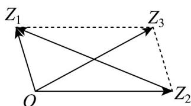

> [!faq]- 《专题08 复数的概念（高效培优期中专项训练）数学人教A版高一必修第二册》官方解析
>
> > [!success]- **【答案】** A
>
> > [!note]- **【解析】**
> > 设 $z_{1}, z_{2}$ 在复平面中对应的向量为 $\overline{OZ_1}, \overline{OZ_2}$ ， $z_{1} + z_{2}$ 对应的向量为 $\overline{OZ_3}$ ，如下图所示：
> >
> > 
> >
> > 因为 $z_{1} + z_{2} = \sqrt{3} +\mathrm{i}$ ，所以 $\left|z_1 + z_2\right| = \sqrt{3 + 1} = 2$ ，所以 $\cos \angle OZ_1Z_3 = \frac{2^2 + 2^2 - 2^2}{2\times 2\times 2} = \frac{1}{2}$
> >
> > 又因为 $\angle OZ_{1}Z_{3} + \angle Z_{1}OZ_{2} = 180^{\circ}$ ，所以 $\cos \angle Z_1OZ_2 = -\cos \angle OZ_1Z_3 = -\frac{1}{2}$
> >
> > 所以 $\left|Z_{2}Z_{1}\right|^{2}=OZ_{1}^{2}+OZ_{2}^{2}-2OZ_{1}\cdot OZ_{2}\cdot\cos\angle Z_{1}OZ_{2}=4+4+4=12$
> >
> > 所以 $\left|Z_{2}Z_{1}\right|=2\sqrt{3}$ ，又 $\left|z_{1}-z_{2}\right|=\left|Z_{2}Z_{1}\right|=2\sqrt{3}$
> >
> > 故选：A.
> >
> > 考点08由复数模求参数
