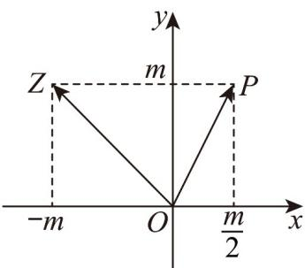

> [!faq]- 《专题08 复数的概念（高效培优期中专项训练）数学人教A版高一必修第二册》官方解析
>
> > [!success]- **【答案】**  A. $\left(\frac{1}{5},\frac{2}{5}\right)$ B. $\left(\frac{2}{5},\frac{4}{5}\right)$ C. (6.5) D. $\left(\frac{4}{5},\frac{8}{5}\right)$
>
> > [!note]- **【解析】**
> > 由题图可知， $z = -m + m\mathrm{i}(m > 0)$ ，则 $|z - \mathrm{i}| = |-m + (m - 1)\mathrm{i}| = \sqrt{m^2 + (m - 1)^2} = 5$ 解得 $m = 4$ （ $m = -3$ 舍去），所以 $\overline{OZ} = (-4, 4)$ ， $\overline{OP} = (2, 4)$ ，则向量 $\overline{OZ}$ 在向量 $\overline{OP}$ 上的投影向量为 $\frac{\overline{OZ} \cdot OP}{|OP|} \cdot \frac{\overline{OP}}{|OP|}$ ，所以其坐标为 $\frac{(-4, 4) \cdot (2, 4)}{\sqrt{2^2 + 4^2}} \times \frac{(2, 4)}{\sqrt{2^2 + 4^2}} = \frac{8}{\sqrt{20}} \times \frac{(2, 4)}{\sqrt{20}} = \left(\frac{4}{5}, \frac{8}{5}\right)$ .
> >
> > 故选 **D**
