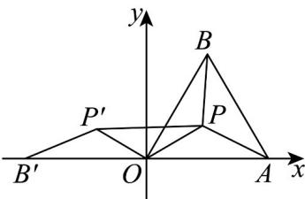

> [!faq]- 《专题08 复数的概念（高效培优期中专项训练）数学人教A版高一必修第二册》官方解析
>
> > [!success]- **【答案】** $\frac{4\sqrt{3}}{3}$
>
> > [!note]- **【解析】**
> > $\because |z| + \left|\frac{\sqrt{3}}{3} z - \frac{2\sqrt{3}}{3}\right| + \left|\frac{\sqrt{3}}{3} z - \frac{\sqrt{3}}{3} -\mathrm{i}\right| = \frac{\sqrt{3}}{3}\left(\sqrt{3}|z| + |z - 2| + |z - 1 - \sqrt{3}\mathrm{i}|\right),$
> >
> > 在复平面中，设点 $O(0,0), A(2,0), B(1,\sqrt{3})$
> >
> > 则 $\frac{\sqrt{3}}{3}\left(\sqrt{3}|z| + |z - 2| + |z - 1 - \sqrt{3}\mathrm{i}|\right) = \frac{\sqrt{3}}{3}\left(\sqrt{3}|PO| + |PA| + |PB|\right)$ ，且 $\triangle OAB$ 为等边三角形，如图，将 $\triangle OPB$ 逆时针旋转 $120^{\circ}$ 得到 $\triangle OP'B'$ ， $\triangle OPB \cong \triangle OP'B'$ ，
> >
> > 
> >
> > $$
> > P B = P ^ {\prime} B ^ {\prime}, O B = O B ^ {\prime} = 2
> > $$
> >
> > $$
> > O P = O P ^ {\prime}, \angle P O P ^ {\prime} = 1 2 0 ^ {\circ}
> > $$
> >
> > $$
> > P P ^ {\prime} = \sqrt {3} | P O |
> > $$
> >
> > $$
> > \frac {\sqrt {3}}{3} \left(\sqrt {3} | P O | + | P A | + | P B |\right) = \frac {\sqrt {3}}{3} \left(| B ^ {\prime} P ^ {\prime} | + | P ^ {\prime} P | + | P A |\right) \quad \frac {\sqrt {3}}{3} | B ^ {\prime} A | = \frac {4 \sqrt {3}}{3}
> > $$
> >
> > 故答案为： $\frac{4\sqrt{3}}{3}$
