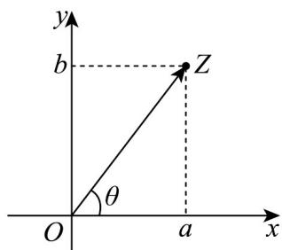

> [!faq]- 《专题10 复数的三角表示（高效培优期中专项训练）数学人教A版高一必修第二册》官方解析
>
> > [!success]- **【答案】** (1) $\theta=2k\pi+\frac{7\pi}{6}(k\in\mathbf{Z})$ (2) $k\pi - \frac{\pi}{4} < \theta < k\pi + \frac{\pi}{4} (k \in \mathbf{Z})$ .
>
> > [!note]- **【解析】**
> > （1）因为在复平面内， $z_{1}$ 与 $z_{2}$ 对应的点关于实轴对称，
> >
> > 所以 $\left\{\begin{aligned}\cos\theta&=\sqrt{3}\sin\theta\\ \sin2\theta&=-\cos\theta\end{aligned}\right.$ ，即 $\left\{\begin{aligned}\cos\theta&=\sqrt{3}\sin\theta\\ \cos\theta(2\sin\theta+1)&=0\end{aligned}\right.$
> >
> > 解得 $\left\{ \begin{array}{l} \theta = k\pi + \frac{\pi}{6} \\ \theta = k\pi + \frac{\pi}{2}, \text{或} \theta = 2k\pi + \frac{7\pi}{6}, \text{或} \theta = 2k\pi + \frac{11\pi}{6} (k \in \mathbf{Z}) \end{array} \right.$
> >
> > 所以 $\theta = 2k\pi + \frac{7\pi}{6} (k \in \mathbf{Z})$ .
> >
> > (2) 由 $|z_2| < \sqrt{2}$ ，得 $\sqrt{\left(\sqrt{3} \sin \theta\right)^2 + \cos^2 \theta} < \sqrt{2}$ ，即 $3 \sin^2 \theta + \cos^2 \theta < 2$ ，
> >
> > 整理得 $\sin^2\theta < \frac{1}{2}$ ，所以 $k\pi - \frac{\pi}{4} < \theta < k\pi + \frac{\pi}{4}(k \in \mathbf{Z})$ .
> >
> > 8. 我们知道，复数可以用 $a + b\mathrm{i}(a,b\in \mathbf{R})$ 的形式来表示，与复平面内的点 $Z(a,b)$ 是一一对应的，复数的模$|z|=|a+bi|=\sqrt{a^{2}+b^{2}}$ ，即是复平面内的点 $Z(a,b)$ 到坐标原点O的距离 $\left|OZ\right|$ ．又复数与平面向量 $OZ=(a,b)$ 也是一一对应的，所以也可以借助与x非负半轴为始边，以向量 $OZ$ 所在射线（射线OZ）为终边的角 $\theta$ 来刻画 $OZ$ 的方向，在此基础上再来认识一下复数的乘除法运算．
> >
> > 
> >
> > 如： $z_{1} = 1 + \sqrt{3}\mathrm{i}$ ， $\left|z_1\right| = 2$ ，角 $\theta_{1} = \frac{\pi}{6}$ ； $z_{2} = \sqrt{3} +\mathrm{i}$ ， $\left|z_2\right| = 2$ ，角 $\theta_{2} = \frac{\pi}{3}$ ，由 $z_{1}\cdot z_{2} = (1 + \sqrt{3}\mathrm{i})\times (\sqrt{3} +\mathrm{i}) = 4\mathrm{i}$ .即：复数 $z = z_{1}\cdot z_{2}$ ，相当于将复数 $z_{1}$ 伸长了 $\left|z_2\right|$ 倍，同时逆时针旋转角 $\theta_{2}$ 后得到.
> >
> > (1)计算 $\frac{a + bi}{i} (a,b\in \mathbf{R})$ ，并从模与角度的变化来解释除法运算的几何意义；
> >
> > (2)现将直角坐标平面内任意一点 $P(x,y)$ ，绕坐标原点逆时针旋转 $\theta$ 角，并将 $|OP|$ 的长度伸长 $m$ 倍后得到点 $Q(x',y')$ 。请借助以上复数运算的知识，推导点 $P$ 与点 $Q$ 伸缩旋转变换的坐标关系；
> >
> > (3)已知反比例函数 $C:y = \frac{1}{x}$ ，现将函数 $C$ 上的点 $P(x,y)$ 都逆时针旋转 $45^{\circ}$ 后得到点 $Q\left(x^{\prime},y^{\prime}\right)$ 的曲线 $C'$ ，求曲线 $C'$ 上的点 $Q\left(x',y'\right)$ 坐标关系式。
> >
> > 【答案】(1)答案见解析 (2) $\left\{ \begin{array}{l}x^{\prime} = m(x\cos \theta -y\sin \theta)\\ y^{\prime} = m(x\sin \theta +y\sin \theta) \end{array} \right.$ (3) $\frac{y'^2}{2} -\frac{x'^2}{2} = 1$
> >
> > 【详解】（1）令 $z_{1} = a + bi$ ， $z_{2} = i$ ， $z = \frac{z_1}{z_2} = \frac{a + bi}{i} = b - ai$ ，则 $\left|z_1\right| = \sqrt{a^2 + b^2}$ ， $\left|z_2\right| = 1$ ， $\left|z\right| = \sqrt{a^2 + b^2}$ ， $OZ_{1} = (a,b)$ ， $OZ_{2} = (0,1)$ ， $OZ = (b, - a)$
> >
> > 复数 $z$ 相当于将复数 $z_{1}$ 缩短了 $\left|z_2\right|$ 倍，顺时针旋转了 $\frac{\pi}{2}$ 得到
> >
> > (2) 设点 $P(x, y)$ 对应的复数为： $z_{1} = x + yi$ ，设： $z_{2} = m \cos \theta + m \sin \theta i$ ，
> >
> > 点 $Q(x', y')$ 对应的复数为 $z = x' + y'i$ ，则
> >
> > $$
> > z = z _ {1} z _ {2} = (x + y \mathrm{i}) (m \cos \theta + m \sin \theta \mathrm{i}) = m (x \cos \theta - y \sin \theta) + m (x \sin \theta + y \sin \theta) \mathrm{i} = x ^ {\prime} + y ^ {\prime} \mathrm{i} \text {所以}
> > $$
> >
> > $$
> > \left\{ \begin{array}{l} x ^ {\prime} = m (x \cos \theta - y \sin \theta) \\ y ^ {\prime} = m (x \sin \theta + y \sin \theta) \end{array} \right.
> > $$
> >
> > (3) 由 (2) 知： $\left\{\begin{aligned}x^{\prime}&=x\cos\theta-y\sin\theta=\frac{\sqrt{2}}{2}(x-y)\\ y^{\prime}&=x\sin\theta+y\sin\theta=\frac{\sqrt{2}}{2}(x+y)\end{aligned}\right.$ ， $\Leftrightarrow\left\{\begin{aligned}x&=\frac{\sqrt{2}}{2}(x^{\prime}+y^{\prime})\\ y&=\frac{\sqrt{2}}{2}(y^{\prime}-x^{\prime})\end{aligned}\right.$
> >
> > 代入反比例函数 $C: y = \frac{1}{x}$ 得到 $\frac{\sqrt{2}}{2}(y' - x') = \frac{1}{\frac{\sqrt{2}}{2}(x' + y')}$ ，化简得： $\frac{y'^{2}}{2} - \frac{x'^{2}}{2} = 1$ 。
> >
> > 9. 1748年，瑞士数学家欧拉发现了复指数函数和三角函数的关系，并写出以下公式 $e^{ix} = \cos x + i\sin x$ （e是自然对数的底，i是虚数单位），这个公式在复变论中占有非常重要的地位，被誉为“数学中的天桥”，已知复数 $z_{1} = e^{ix_{1}}$ ， $z_{2} = e^{ix_{2}}$ ， $z_{3} = e^{ix_{3}}$ 在复平面内对应的点分别为 $Z_{1}$ ， $Z_{2}$ ， $Z_{3}$ ，且 $e^{ix}$ 的共轭复数为 $\overline{e^{ix}} = e^{-ix}$ ，则下列说法正确的是（）A. $\cos x = \frac{e^{ix} + e^{-ix}}{2}$ B. $e^{2i}$ 表示的复数对应的点在复平面内位于第一象限C. $\overline{e^{ix_{1}} + e^{ix_{2}} + e^{ix_{3}}} = \overline{e^{ix_{1}}} + \overline{e^{ix_{2}}} + \overline{e^{ix_{3}}}$ D. 若 $Z_{1}$ ， $Z_{2}$ 为两个不同的定点， $Z_{3}$ 为线段 $Z_{1}Z_{2}$ 的垂直平分线上的动点，则 $|z_{1} - z_{3}| = |z_{2} - z_{3}|$
> >
> > 【答案】 ACD
> >
> > 【详解】解：对于 A 选项，∵ $e^{ix} = \cos x + i \sin x$ ， $e^{-ix} = \cos(-x) + i \sin(-x) = \cos x - i \sin x$ ∴ $e^{ix} + e^{-ix} = 2 \cos x$ 则 $\cos x = \frac{e^{ix} + e^{-ix}}{2}$ ，选项 A 正确；
> > 对于 B 选项， $e^{2i} = \cos 2 + i \sin 2$ ∴ $\frac{\pi}{2} < 2 < \pi$ ，∴ $\cos 2 < 0$ ， $\sin 2 > 0$ ，
> > ∴ $e^{2i}$ 表示的复数对应的点在复平面中位于第二象限，选项 B 错误；
> > 对于 C 选项， $e^{ix_{1}} + e^{ix_{2}} + e^{ix_{3}} = (\cos x_{1} + \cos x_{2} + \cos x_{3}) + (\sin x_{1} + \sin x_{2} + \sin x_{3})i$ 则 $\overline{e^{ix_{1}}+e^{ix_{2}}+e^{ix_{3}}}=\left(\cos x_{1}+\cos x_{2}+\cos x_{3}\right)-\left(\sin x_{1}+\sin x_{2}+\sin x_{3}\right)i$
> >
> > $$
> > \therefore \overline {{\mathrm{e} ^ {\mathrm{i} x _ {1}}}} + \overline {{\mathrm{e} ^ {\mathrm{i} x _ {2}}}} + \overline {{\mathrm{e} ^ {\mathrm{i} x _ {3}}}} = \mathrm{e} ^ {- \mathrm{i} x _ {1}} + \mathrm{e} ^ {- \mathrm{i} x _ {2}} + \mathrm{e} ^ {- \mathrm{i} x _ {3}} = (\cos x _ {1} + \cos x _ {2} + \cos x _ {3}) - (\sin x _ {1} + \sin x _ {2} + \sin x _ {3}) \mathrm{i}
> > $$
> >
> > $\therefore \overline{\mathrm{e}^{\mathrm{i}x_1} + \mathrm{e}^{\mathrm{i}x_2} + \mathrm{e}^{\mathrm{i}x_3}} = \overline{\mathrm{e}^{\mathrm{i}x_1}} + \overline{\mathrm{e}^{\mathrm{i}x_2}} + \overline{\mathrm{e}^{\mathrm{i}x_3}}$ ，选项C正确；
> >
> > 对于 D 选项， $\left|z_{1}-z_{3}\right|$ 可转化为 $Z_{1}$ 与 $Z_{3}$ 两点间距离， $\left|z_{2}-z_{3}\right|$ 可转化为 $Z_{2}$ 与 $Z_{3}$ 两点间距离，
> >
> > 由于 $Z_{3}$ 为线段 $Z_{1}Z_{2}$ 的垂直平分线上的动点，
> >
> > 根据垂直平分线的性质可知 $Z_{1}$ 与 $Z_{3}$ 两点间距离等于 $Z_{2}$ 与 $Z_{3}$ 两点间距离，
> >
> > 则 $\left|z_{1}-z_{3}\right|=\left|z_{2}-z_{3}\right|$ ，选项D正确.
> >
> > 故选 **ACD**.
