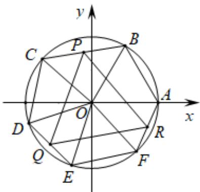
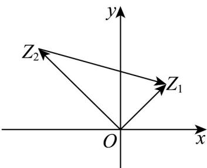

> [!faq]- 《专题10 复数的三角表示（高效培优期中专项训练）数学人教A版高一必修第二册》官方解析
>
> > [!success]- **【答案】** A. $z_{1}^{2} = \left|z_{1}\right|^{2}$ B. $\overline{z_1\cdot z_2} = \overline{z_1}\cdot \overline{z_2}$ C. $\left|z_1z_2\right| = \left|z_1\right|\cdot \left|z_2\right|$ D.若 $z_{1}z_{2} = z_{1}z_{3}$ ，且 $z_{1}\neq 0$ ，则 $z_{2} = z_{3}$
>
> > [!note]- **【解析】**
> > 对于 A 项，当 $z_{1}=i$ 时， $z_{1}^{2}=i^{2}=-1$ ，而 $\left|z_{1}\right|^{2}=\left|i\right|^{2}=1$ ，故 A 项错误；
> >
> > 对于 B 项，设 $z_{1}=r_{1}(\cos\alpha+i\sin\alpha)$ ， $z_{2}=r_{2}(\cos\beta+i\sin\beta)$ ，其中 $r_{1}>0, r_{2}>0$
> >
> > 则 $z_{1}\cdot z_{2} = r_{1}r_{2}[\cos (\alpha +\beta) + \mathrm{i}\sin (\alpha +\beta)]$ ，则 $\overline{z_1\cdot z_2} = r_1r_2[\cos (\alpha +\beta) - \mathrm{i}\sin (\alpha +\beta)]$
> >
> > $$
> > \overline {{z _ {1}}} \cdot \overline {{z _ {2}}} = r _ {1} (\cos \alpha - \mathrm{i} \sin \alpha) \cdot r _ {2} (\cos \beta - \mathrm{i} \sin \beta) = r _ {1} r _ {2} [ \cos (- \alpha) + \mathrm{i} \sin (- \alpha) ] [ \cos (- \beta) + \mathrm{i} \sin (- \beta) ]
> > $$
> >
> > $= r_{1}r_{2}[\cos (-\alpha -\beta) + \mathrm{i}\sin (-\alpha -\beta)] = r_{1}r_{2}[\cos (\alpha +\beta) - \mathrm{i}\sin (\alpha +\beta)]$ ，故B项正确；
> >
> > $$
> > \mathrm{C}
> > $$
> >
> > $$
> > z _ {1} = r _ {1} (\cos \alpha + \mathrm{i} \sin \alpha), z _ {2} = r _ {2} (\cos \beta + \mathrm{i} \sin \beta),
> > $$
> >
> > $$
> > r _ {1} > 0, r _ {2} > 0
> > $$
> >
> > $z_{1}\cdot z_{2}=r_{1}r_{2}[\cos(\alpha+\beta)+\mathrm{i}\sin(\alpha+\beta)]$ ，则 $|z_{1}z_{2}|=r_{1}r_{2}$ ，而 $\left|z_{1}\right|\cdot\left|z_{2}\right|=r_{1}r_{2}$ ，故C项正确；
> >
> > 对于 D 项，设 $z_{1}=a+bi, z_{2}=c+di, z_{3}=m+ni,$ 其中， $a, b, c, d, m, n \in R$ ，依题，a, b 不全为零，
> >
> > 则由 $z_{1}z_{2}=z_{1}z_{3}$ 可得 $(a+bi)(c+di)=(a+bi)(m+ni)$ ，化简得
> >
> > $(ac - bd) + (ad + bc)\mathrm{i} = (am - bn) + (an + bm)\mathrm{i}$ ，即 $\left\{ \begin{array}{l}ac - bd = am - bn\\ ad + bc = an + bm \end{array} \right.$
> >
> > 因 $a, b$ 不全为零，不妨设 $b \neq 0$ ，则有 $\frac{a}{b} = \frac{d - n}{c - m} = \frac{m - c}{d - n}$ ，即 $(d - n)^2 + (m - c)^2 = 0$
> >
> > 故得 $m = c, n = d$ ，即 $z_{2} = z_{3}$ ，故 D 项正确。
> >
> > 故选：BCD.
> >
> > 13. 将复数 $z = a + b\mathrm{i}(a, b \in \mathbf{R})$ ，表示成三角形式 $z = r(\cos \theta + \mathrm{i}\sin \theta)$ ，其中 $r = \sqrt{a^2 + b^2}$ ， $\cos \theta = \frac{a}{r}$ ， $\sin \theta = \frac{b}{r}$ ， $r$ 是复数 $z$ 的模， $\theta$ 是复数 $z$ 的辐角。
> >
> > (1)求方程 $x^{3} + 1 = 0$ 的复数根，并用复数的三角形式表示虚部大于零的根；
> >
> > (2)已知 $z_{1} = r_{1}\left(\cos \theta_{1} + \mathrm{i}\sin \theta_{1}\right)$ ， $z_{2} = r_{2}\left(\cos \theta_{2} + \mathrm{i}\sin \theta_{2}\right)$ ，试推导复数 $z_{1}z_{2}$ 的三角形式；
> >
> > (3)在单位圆的内接六边形 $ABCDEF$ 中， $\left|AB\right| = \left|CD\right| = \left|EF\right| = 1$ ， $P, Q, R$ 分别为 $BC, DE, FA$ 的中点，判
> >
> > 断 $\triangle PQR$ 的形状并证明·
> >
> > 【答案】(1) $z_{1}=-1,\quad z_{2}=\frac{1}{2}+\frac{\sqrt{3}}{2}\mathrm{i},\quad z_{3}=\frac{1}{2}-\frac{\sqrt{3}}{2}\mathrm{i},\quad z_{2}=\cos\frac{\pi}{3}+\mathrm{i}\sin\frac{\pi}{3}$
> >
> > (2) $r_{1}r_{2}\left[\cos\left(\theta_{1}+\theta_{2}\right)+\mathrm{i}\sin\left(\theta_{1}+\theta_{2}\right)\right]$
> >
> > (3) $\triangle PQR$ 为正三角形，证明见解析
> >
> > 【详解】（1）由立方和公式得， $x^{3}+1=(x+1)(x^{2}-x+1)=0$ ，
> >
> > 可得 $x + 1 = 0$ 或 $x^{2} - x + 1 = 0$
> >
> > 解得三个根为 $z_{1} = -1$ ， $z_{2} = \frac{1}{2} +\frac{\sqrt{3}}{2}\mathrm{i}$ ， $z_{3} = \frac{1}{2} -\frac{\sqrt{3}}{2}\mathrm{i}$ ， $z_{2} = \cos \frac{\pi}{3} +\mathrm{i}\sin \frac{\pi}{3}$
> >
> > $$
> > z _ {1} z _ {2} = r _ {1} \left(\cos \theta_ {1} + \mathrm{i} \sin \theta_ {1}\right) r _ {2} \left(\cos \theta_ {2} + \mathrm{i} \sin \theta_ {2}\right) \tag {2}
> > $$
> >
> > $$
> > = r _ {1} r _ {2} \left[ \cos \theta_ {1} \cos \theta_ {2} - \sin \theta_ {1} \sin \theta_ {2} + i (\sin \theta_ {1} \cos \theta_ {2} + \cos \theta_ {1} \sin \theta_ {2}) \right]
> > $$
> >
> > $$
> > = r _ {1} r _ {2} \left[ \cos \left(\theta_ {1} + \theta_ {2}\right) + \mathrm{i} \sin \left(\theta_ {1} + \theta_ {2}\right) \right]
> > $$
> >
> > (3) 将六边形 $ABCDEF$ 按逆时针顺序排列，六个顶点及 $P, Q, R$ 对应的复数依次记为 $z_A, z_B, \cdots, z_F, z_P, z_Q, z_R$
> >
> > 以单位圆的圆心 O 为坐标原点，建立平面直角坐标系，
> >
> > 设 $z_{A} = 1$ ，由题意 $\left|AB\right| = \left|CD\right| = \left|EF\right| = 1$ ，得 $\angle AOB = \angle COD = \angle EOF = 60^{\circ}$
> >
> > $$
> > z _ {B} = \cos \frac {\pi}{3} + \mathrm{i} \sin \frac {\pi}{3}, z _ {D} = z _ {C} \left(\cos \frac {\pi}{3} + \mathrm{i} \sin \frac {\pi}{3}\right) = z _ {C} z _ {B}, z _ {F} = z _ {E} \left(\cos \frac {\pi}{3} + \mathrm{i} \sin \frac {\pi}{3}\right) = z _ {E} z _ {B},
> > $$
> >
> > 
> >
> > $$
> > z _ {P} = \frac {1}{2} \left(z _ {B} + z _ {C}\right) \quad z _ {Q} = \frac {1}{2} \left(z _ {D} + z _ {E}\right) \quad z _ {R} = \frac {1}{2} \left(z _ {F} + z _ {A}\right)
> > $$
> >
> > $$
> > z _ {Q} - z _ {P} = \frac {1}{2} \left[ z _ {D} + z _ {E} - (z _ {B} + z _ {C}) \right], z _ {R} - z _ {P} = \frac {1}{2} \left[ z _ {F} + z _ {A} - (z _ {B} + z _ {C}) \right],
> > $$
> >
> > $$
> > \left(z _ {Q} - z _ {P}\right) z _ {B} = \frac {1}{2} \left[ z _ {D} + z _ {E} - \left(z _ {B} + z _ {C}\right) \right] z _ {B}
> > $$
> >
> > $$
> > = \frac {1}{2} \left[ z _ {C} z _ {B} + z _ {E} - (z _ {B} + z _ {C}) \right] z _ {B} = \frac {1}{2} \left[ z _ {C} z _ {B} ^ {2} + z _ {E} z _ {B} - z _ {B} ^ {2} - z _ {C} z _ {B} \right],
> > $$
> >
> > 由（1）知 $z_{B}^{2} - z_{B} + 1 = 0$
> >
> > $$
> > \left(z _ {Q} - z _ {P}\right) z _ {B} = \frac {1}{2} \left[ z _ {C} (z _ {B} - 1) + z _ {E} z _ {B} - (z _ {B} - 1) - z _ {C} z _ {B} \right]
> > $$
> >
> > $$
> > = \frac {1}{2} \Bigl [ - z _ {C} + z _ {F} - z _ {B} + z _ {A} \Bigr ] = z _ {R} - z _ {P}
> > $$
> >
> > 由复数乘法的几何意义， $PQ$ 逆时针旋转 $\frac{\pi}{3}$ 与 $PR$ 重合，故 $\triangle PQR$ 为正三角形
> >
> > 14. 形如 $z = a + b\mathrm{i}(a, b \in \mathbf{R})$ 的数称为复数的代数形式，而任何一个复数 $z = a + b\mathrm{i}$ 都可以表示成
> >
> > $r(\cos\theta+\mathrm{i}\sin\theta)$ 的形式，即 $\left\{\begin{aligned}a&=r\cos\theta,\\ b&=r\sin\theta,\end{aligned}\right.$ 其中为复数的模，叫做复数的辐角，我们规定 $0\leq\theta<2\pi$ 范围内的辐角θ的值为辐角的主值，记作 $\arg z$ ．复数 $z=r(\cos\theta+\mathrm{i}\sin\theta)$ 叫做复数的三角形式．由复数的三角形式可得出，若 $\overline{OZ_{1}}=r_{1}(\cos\theta_{1}+\mathrm{i}\sin\theta_{1}),\overline{OZ_{2}}=r_{2}(\cos\theta_{2}+\mathrm{i}\sin\theta_{2})$ ，则
> >
> > $r_{1}\left(\cos\theta_{1}+\mathrm{i}\sin\theta_{1}\right)\cdot r_{2}\left(\cos\theta_{2}+\mathrm{i}\sin\theta_{2}\right)=r_{1}r_{2}\left[\cos\left(\theta_{1}+\theta_{2}\right)+\mathrm{i}\sin\left(\theta_{1}+\theta_{2}\right)\right]$ ．其几何意义是把向量 $OZ_{1}$ 绕点O按逆时针方向旋转角 $\theta_{2}$ （如果 $\theta_{2}<0$ ，就要把 $\overline{OZ_{1}}$ 绕点O按顺时针方向旋转角 $\left|\theta_{2}\right|$ ），再把它的模变为原来的 $r_{2}$ 倍．
> >
> > (1)试将 $z = 3 + \sqrt{3}i$ 写成三角形式（辐角取主值）；
> >
> > (2)复平面内，将 $z = 3 + \sqrt{3}\mathrm{i}$ 对应的向量绕原点 $O$ 顺时针方向旋转 $60^{\circ}$ ，模长变为原来的 $2$ 倍后，所得向量对应的复数为 $z_{1}$ ，求 $z_{1}\left(\cos \frac{\pi}{10} + \mathrm{i}\sin \frac{\pi}{10}\right)\left(\cos \frac{3\pi}{10} + \mathrm{i}\sin \frac{3\pi}{10}\right)\left(\cos \frac{3\pi}{5} + \mathrm{i}\sin \frac{3\pi}{5}\right)$ ；
> >
> > (3)类比高中函数的定义，引入虚数单位，自变量为复数的函数称之为复变函数．已知复变函数
> >
> > $f(x) = x^{2} + \frac{1}{x^{2}}, x \in \mathbf{C}$ 。若存在实部不为 $0$ ，且虚部大于 $0$ 的复数 $x$ 和实数 $t$ ，使得 $f(x)$ $t$ 成立，复数 $x$ 在复平面上对应的点为 $A, O$ 为坐标原点，点 $P(3,0)$ ，以 $PA$ 为边作正方形 $PAMN$ ，其中 $M, N$ 在 $PA$ 上方，求线段 $OM$ 的最大值。
> >
> > 【答案】(1) $z=2\sqrt{3}\left(\cos\frac{\pi}{6}+i\sin\frac{\pi}{6}\right)$ (2) $-6+2\sqrt{3}i$ (3) $|OM|_{\max}=\sqrt{11+6\sqrt{2}}$ 【详解】(1)由于 $z=3+\sqrt{3}i$ ，故 $|z|=2\sqrt{3}$ ，所以 $z=2\sqrt{3}\left(\frac{\sqrt{3}}{2}+\frac{1}{2}i\right)$ ，
> >
> > 所以 $\cos\theta=\frac{\sqrt{3}}{2},\sin\theta=\frac{1}{2}$ ，因为 $0\leq\theta<2\pi$ ，所以 $\theta=\frac{\pi}{6}$ ，
> >
> > 所以 $z=2\sqrt{3}\left(\cos\frac{\pi}{6}+i\sin\frac{\pi}{6}\right)$ .
> >
> > (2) $z_1=z\cdot\left(\cos\left(-\frac{\pi}{3}\right)+i\sin\left(-\frac{\pi}{3}\right)\right)\times2$ $=2\sqrt{3}\left(\cos\frac{\pi}{6}+i\sin\frac{\pi}{6}\right)\cdot\left(\cos\left(-\frac{\pi}{3}\right)+i\sin\left(-\frac{\pi}{3}\right)\right)\times2$ $=4\sqrt{3}\left(\cos\left(-\frac{\pi}{6}\right)+i\sin\left(-\frac{\pi}{6}\right)\right)$ . $z_1\left(\cos\frac{\pi}{10}+i\sin\frac{\pi}{10}\right)\left(\cos\frac{3\pi}{10}+i\sin\frac{3\pi}{10}\right)\left(\cos\frac{3\pi}{5}+i\sin\frac{3\pi}{5}\right)$ $=z_1\cdot(\cos\pi+i\sin\pi)=4\sqrt{3}\left(\cos\left(-\frac{\pi}{6}\right)+i\sin\left(-\frac{\pi}{6}\right)\right)(\cos\pi+i\sin\pi)$ $=4\sqrt{3}\left(\frac{\sqrt{3}}{2}-\frac{i}{2}\right)\times(-1)=-6+2\sqrt{3}i$ .
> >
> > (3)设 $x=a+bi(a,b\in R,a\neq0,b>0)$ ，
> >
> > 则 $f(x)=x^2+\frac{1}{x^2}=(a+bi)^2+\frac{1}{(a+bi)^2}=\left(a^2-b^2\right)+2abi+\frac{1}{\left(a^2-b^2\right)+2abi}$ $=\left(a^2-b^2\right)+2abi+\frac{\left(a^2-b^2\right)-2abi}{\left[\left(a^2-b^2\right)+2abi\right]\cdot\left[\left(a^2-b^2\right)-2abi\right]}=\left(a^2-b^2\right)+2abi+\frac{\left(a^2-b^2\right)-2abi}{\left(a^2-b^2\right)^2+4a^2b^2}$ $=\left(a^2-b^2\right)+2abi+\frac{\left(a^2-b^2\right)-2abi}{\left(a^2+b^2\right)^2}=\left(a^2-b^2\right)\frac{a^2-b^2}{\left(a^2+b^2\right)^2}+2abi-\frac{2abi}{\left(a^2+b^2\right)^2}$ $=\left(a^2-b^2\right)+\frac{a^2-b^2}{\left(a^2+b^2\right)^2}+\left[2ab-\frac{2ab}{\left(a^2+b^2\right)^2}\right]i$ .
> >
> > 因为存在实数 $M$ ，使得 $f(x) \quad M$ 成立，所以 $f(x)$ 为实数，
> >
> > 所以 $2ab - \frac{2ab}{\left(a^{2} + b^{2}\right)^{2}} = 0$ ，
> >
> > 因为 $a \neq 0, b > 0$ ，所以 $a^2 + b^2 = 1$
> >
> > 当 $a^2 + b^2 = 1$ 时， $f(x) = 2(a^2 - b^2) = 2(2a^2 - 1) > -2 (a \neq 0)$ ，符合题意，点 $\mathbb{A}$ 的轨迹为单位圆的一部分。
> >
> > 设 $A(\cos \theta, \sin \theta), \theta \in \left(0, \frac{\pi}{2}\right) \cup \left(\frac{\pi}{2}, \pi\right), PA = (\cos \theta - 3, \sin \theta)$ 所表示的复数为 $z_{1}$ ，
> >
> > 则 $z_{1} = (\cos \theta -3) + i\cdot \sin \theta$
> >
> > 记 $\frac{\sqrt{2}}{PM}$ 所表示的复数为 $z_{2}$ ，则 $z_{2} = z_{1} \cdot \left[\cos\left(-\frac{\pi}{4}\right) + i\sin\left(-\frac{\pi}{4}\right)\right] \cdot \sqrt{2}$ ，
> >
> > $$
> > z _ {2} = \left[ (\cos \theta - 3) + \mathrm{i} \cdot \sin \theta \right] \cdot \left(\frac {\sqrt {2}}{2} - \frac {\sqrt {2}}{2} \mathrm{i}\right) \sqrt {2} = (\cos \theta + \sin \theta - 3) + (\sin \theta - \cos \theta + 3) \mathrm{i}
> > $$
> >
> > 故 $M(\cos \theta +\sin \theta ,\sin \theta -\cos \theta +3)$
> >
> > $$
> > \mid O M \mid = \sqrt {(\cos \theta + \sin \theta) ^ {2} + (\sin \theta - \cos \theta + 3) ^ {2}} = \sqrt {1 1 + 6 (\sin \theta - \cos \theta)} = \sqrt {1 1 + 6 \sqrt {2} \sin \left(\theta - \frac {\pi}{4}\right)}
> > $$
> >
> > 当 $\sin \left(\theta -\frac{\pi}{4}\right) = 1,\theta = \frac{3}{4}\pi$ 时， $|OM|_{\max} = \sqrt{11 + 6\sqrt{2}}$
> >
> > 15. 任意一个复数 $z$ 的代数形式都可写成三角形式，即 $z = a + bi = r(\cos \theta + \mathrm{i}\sin \theta)$ ，其中i为虚数单位， $r = |z| = \sqrt{a^2 + b^2}$ ， $\cos \theta = \frac{a}{r}$ ， $\sin \theta = \frac{b}{r}$ ， $\theta \in [0, 2\pi)$ ·棣莫弗定理由法国数学家棣莫弗（1667\~1754）创立，指的是设两个复数用三角函数形式表示为： $z_1 = r_1(\cos \theta_1 + \mathrm{i}\sin \theta_1)$ ， $z_2 = r_2(\cos \theta_2 + \mathrm{i}\sin \theta_2)$ ，则 $z_1z_2 = r_1r_2[\cos (\theta_1 + \theta_2) + \mathrm{i}\sin (\theta_1 + \theta_2)]$ ， $\frac{z_1}{z_2} = \frac{r_1}{r_2} [\cos (\theta_1 - \theta_2) + \mathrm{i}\sin (\theta_1 - \theta_2)]$ ，且 $z_2 \neq 0$ ·若令 $z_1 = z_2 = \dots = z_n = z$ ，则能导出复数乘方公式： $z^n = r^n (\cos n\theta + \mathrm{i}\sin n\theta)$ ·请用以上知识解决以下问题：
> >
> > (1)试将 $z = -\sqrt{3} + 3\mathrm{i}$ 写成三角形式；
> >
> > (2)已知 $\left|z_{1}\right|=3,\left|z_{2}\right|=5,\left|z_{1}-z_{2}\right|=7$ ，求 $\frac{z_{1}}{z_{2}}$ 的值；
> >
> > (3)设 $z = a + bi$ ， $a$ ， $b\in \mathbb{R}$ ，当 $\left|z\right| = 1$ 时，求 $z^{2} + z + 1$ 的最大值和最小值
> >
> > 【答案】(1) $z=2\sqrt{3}(\cos\frac{2\pi}{3}+\mathrm{i}\sin\frac{2\pi}{3})$ (2) $\frac{z_{1}}{z_{2}}=-\frac{3}{10}\pm\frac{3\sqrt{3}}{10}\mathrm{i}$
> >
> > (3) $z^2 + z + 1$ 的最大值是 $3$ ，最小值是 $0$ .
> >
> > 【详解】（1）运用复数的三角形式得到 $z = -\sqrt{3} + 3\mathrm{i} = 2\sqrt{3}\left(-\frac{1}{2} + \frac{\sqrt{3}}{2}\mathrm{i}\right) = 2\sqrt{3}\left(\cos \frac{2\pi}{3} + \mathrm{i}\sin \frac{2\pi}{3}\right)$ .
> >
> > (2) 如图，设复数 $z_{1}$ 对应向量为 $\overline{OZ}_{1}$ ，设复数 $z_{2}$ 对应向量为 $\overline{OZ}_{2}$
> >
> > 
> >
> > 则在 $\triangle OZ_{1}Z_{2}$ ，运用余弦定理， $\cos \angle Z_1OZ_2 = \frac{9 + 25 - 49}{2\times 3\times 5} = -\frac{1}{2}$ ，∴ $\sin \angle Z_1OZ_2 = \pm \frac{\sqrt{3}}{2},$
> >
> > $$
> > \left| \frac {z _ {1}}{z _ {2}} \right| = \frac {\left| z _ {1} \right|}{\left| z _ {2} \right|} = \frac {3}{5}, \therefore \frac {z _ {1}}{z _ {2}} = \frac {3}{5} \left(- \frac {1}{2} \pm \frac {\sqrt {3}}{2} \mathrm{i}\right) = - \frac {3}{1 0} \pm \frac {3 \sqrt {3}}{1 0} \mathrm{i}
> > $$
> >
> > (3) $\because |z| = 1$ ，设 $z = \cos \theta + i \sin \theta$ ， $\theta \in \mathbb{R}$
> >
> > 则 $|z^2 + z + 1| = |z^2 + z + z \cdot \overline{z}| = |z(z + \overline{z} + 1)| = |z||z + \overline{z} + 1| = |2\cos \theta + 1|$ ，
> >
> > $\because -1 \leq \cos \theta \leq 1, \therefore -2 \leq 2 \cos \theta \leq 2, \therefore -1 \leq 2 \cos \theta + 1 \leq 3,$
> >
> > $$
> > \therefore \left| z ^ {2} + z + 1 \right| _ {\max} = 3 \quad \left| z ^ {2} + z + 1 \right| _ {\min} = 0.
> > $$
> >
> > ## 考点04三角表示下复数的乘方与开方
