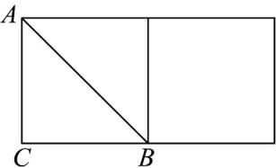
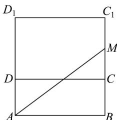
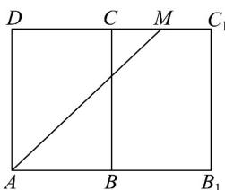
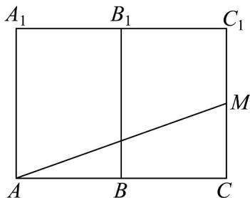

> [!faq]- 《专题11 基本立体图-柱体、椎体、台体（高效培优期中专项训练）数学人教A版高一必修第二册》官方解析
>
> > [!success]- **【答案】** （1） $3\sqrt{2}cm$ ；（2） $\sqrt{41}cm$
>
> > [!note]- **【解析】**
> > 解：（1）根据题意，把圆柱的侧面沿过点 $A$ 的母线剪开，然后展开成为矩形，如图所示，
> >
> > 
> >
> > 连接 AB，则 AB 就是为蚂蚁爬行的最短距离，
> >
> > 因为 $AC = 3cm, CB = \pi \times 1 = 3cm$
> >
> > 所以 $AB = \sqrt{AC^{2} + CB^{2}} = \sqrt{3^{2} + 3^{2}} = 3\sqrt{2} \, (\text{cm})$
> >
> > 所以蚂蚁爬行的最短路线长为 $3\sqrt{2}cm$ ；
> >
> > (2) 根据题意，沿长方体的一条棱剪开，有三种剪法，
> > - **①**：如图 $^{1}$ ，以 DC 为轴展开，
> >
> > 
> > 图1
> >
> > 此时 $AM = \sqrt{4^2 + (3 + 2)^2} = \sqrt{41} cm$
> > - **②**：如图 2. 以 BC 为轴展开，
> >
> > 
> > 图2
> >
> > 此时， $AM = \sqrt{(4 + 2)^2 + 3^2} = 3\sqrt{5} cm$
> > - **③**：如图 $^{3}$ 、以 $BB_{1}$ 为轴展开，
> >
> > 
> > 图3
> >
> > 此时 $AM = \sqrt{2^2 + (4 + 3)^2} = \sqrt{53} cm$
> >
> > 综上，蚂蚁爬行的最短路线长为 $\sqrt{41} cm$
