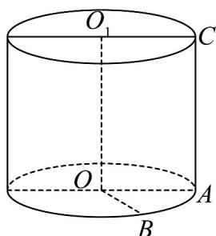
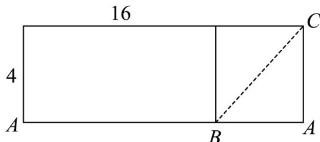

> [!faq]- 《专题11 基本立体图-柱体、椎体、台体（高效培优期中专项训练）数学人教A版高一必修第二册》官方解析
>
> > [!success]- **【答案】** 
>
> > [!note]- **【解析】**
> > 圆柱的高为 $^{4}$ ，底面周长为 $^{16}$ ， $\angle AOB = 90^{\circ}$ ，则在底面圆中 $AB = \frac{1}{4} \times 16 = 4$ 如图将圆柱的侧面沿母线 AC 展开，其侧面展开图是矩形，且矩形的长为 $^{16}$ ，宽为 $^{4}$ .
> > 在此圆柱侧面上，从 B 到 C 的路径中，最短路径的长度为展开图中线段 BC 的长度 $BC=\sqrt{4^{2}+4^{2}}=4\sqrt{2}$ 故答案为： $4\sqrt{2}$
> >
> > 
