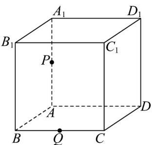
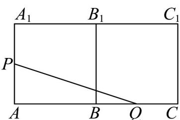
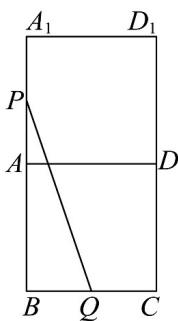
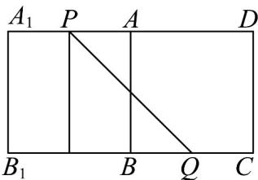

> [!faq]- 《专题11 基本立体图-柱体、椎体、台体（高效培优期中专项训练）数学人教A版高一必修第二册》官方解析
>
> > [!success]- **【答案】** A. $\sqrt{11}$ B. $\sqrt{10}$ C. 3 D. $2\sqrt{2}$
>
> > [!note]- **【解析】**
> > 如图，在正方体 $ABCD - A_{1}B_{1}C_{1}D_{1}$ 中，P、Q 分别为棱 $AA_{1}$ ，BC 的中点，
> >
> > 
> >
> > 按照下列方式展开， $PQ=\sqrt{1^{2}+\left(2+1\right)^{2}}=\sqrt{10}$
> >
> > 
> >
> > 按照下列方式展开， $PQ=\sqrt{1^{2}+(2+1)^{2}}=\sqrt{10}$ ；
> >
> > 
> >
> > 按照下列方式展开， $PQ=\sqrt{2^{2}+2^{2}}=2\sqrt{2}$
> >
> > 
> >
> > 综上所述，最短路径 $PQ = 2\sqrt{2}$
> >
> > 故选 **D**.
