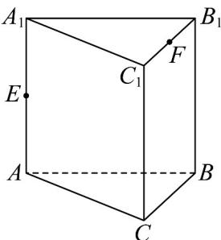
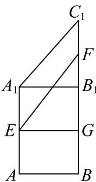
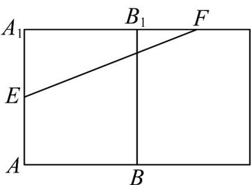
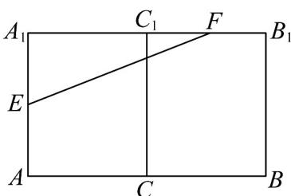
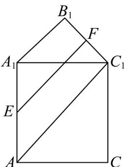

> [!faq]- 《专题11 基本立体图-柱体、椎体、台体（高效培优期中专项训练）数学人教A版高一必修第二册》官方解析
>
> > [!success]- **【答案】**  A. $\sqrt{11}$ B. $\sqrt{7 + 2\sqrt{2}}$ C. 3 D. $\sqrt{7 + \sqrt{2}}$
>
> > [!note]- **【解析】**
> > 若从 E 到 F 经过棱 $A_{1}B_{1}$ 则沿棱 $A_{1}B_{1}$ 展开如图，过 E 作 $EG \perp BB_{1}$ 于 G，则 $EG = AB = 2, \quad FG = 1 + \sqrt{2}$ ，故 $EF = \sqrt{2^{2} + (1 + \sqrt{2})^{2}} = \sqrt{7 + 2\sqrt{2}}$ .
> >
> > 
> >
> > 若从 E 到 F 经过棱 $BB_{1}$ ，则沿棱 $BB_{1}$ 展开如图， $A_{1}E = \sqrt{2}$ ， $A_{1}F = 3$
> >
> > 则 $EF = \sqrt{\left(\sqrt{2}\right)^2 + 3^2} = \sqrt{11}$ .
> >
> > 
> >
> > 若从 $E$ 到 $F$ 经过棱 $CC_{1}$ ，则沿棱 $CC_{1}$ 展开如图，因为 $AB = BC = 2$ ， $\angle ABC = 90^{\circ}$
> >
> > 所以 $AC = \sqrt{2^2 + 2^2} = 2\sqrt{2}$
> >
> > $A_{1}E = \sqrt{2}$ ， $A_{1}F = 2\sqrt{2} +1$ ，则 $EF = \sqrt{2 + (2\sqrt{2} + 1)^2} = \sqrt{11 + 4\sqrt{2}}$
> >
> > 
> >
> > 若从 E 到 F 经过棱 $A_{1}C_{1}$ ，则沿棱 $A_{1}C_{1}$ 展开如图，由题意， $\triangle A_{1}B_{1}C_{1}$ 为等腰直角三角形，四边形 $ACC_{1}A_{1}$ 为正方形，故 $\triangle A_{1}AC_{1}$ 为等腰直角三角形，故四边形 $A_{1}B_{1}C_{1}A$ 为直角梯形。又 $A_{1}B_{1}=2$ ， $AC_{1}=\sqrt{\left(2\sqrt{2}\right)^{2}+\left(2\sqrt{2}\right)^{2}}=4$ ，故 $EF=\frac{1}{2}(2+4)=3$ 。
> >
> > 
> >
> > 故沿棱柱的表面从 E 到 F 的最短路径长度为 3.
> >
> > 故选 **C**
