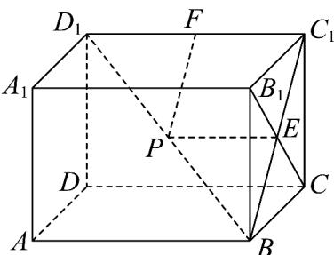
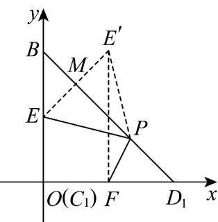

> [!faq]- 《专题11 基本立体图-柱体、椎体、台体（高效培优期中专项训练）数学人教A版高一必修第二册》官方解析
>
> > [!success]- **【答案】** C
>
> > [!note]- **【解析】**
> > 连接 $BC_{1}$ ，则 $BC_{1} \cap B_{1}C = E$ ，点 $P$ 、 $E$ 、 $F$ 在平面 $BC_{1}D_{1}$ 中，
> >
> > 
> >
> > 且 $BC_{1} \perp C_{1}D_{1}, C_{1}D_{1} = 2, BC_{1} = 2$
> >
> > 在 $\mathrm{Rt}^{\triangle}$ $BC_{1}D_{1}$ 中，以 $C_1D_1$ 为 $x$ 轴， $C_1B$ 为 $y$ 轴，建立平面直角坐标系，
> >
> > 
> >
> > 则 $D_{1}(2,0)$ ， $B(0,2)$ ， $E(0,1)$ ， $F(1,0)$ ；
> >
> > 设点 E 关于直线 $BD_{1}$ 的对称点为 $E'$ ，
> >
> > ∵ $BD_{1}$ 的方程为 $x + y = 2$ ，①
> >
> > $\therefore k_{EE'}=1$ ，直线 $EE'$ 的方程为 $y=x+1$ ，②
> >
> > 由①②组成方程组，解得 $x=\frac{1}{2}$ ， $y=\frac{3}{2}$ ，
> >
> > 直线 $EE'$ 与 $BD_{1}$ 的交点 $M(\frac{1}{2},\frac{3}{2})$
> >
> > ∴对称点 $E'(1,2)$
> >
> > $$
> > \therefore P E + P F = P E ^ {\prime} + P F \quad E ^ {\prime} F = 2
> > $$
> >
> > 则 $PE + PF$ 的最小值为 2.
> >
> > 故选 **C**.
