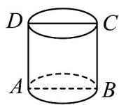
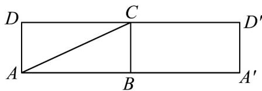

## 考点01 柱体展开图及最短距离问题

1. 圆柱的轴截面是一个边长为 $5\mathrm{cm}$ 的正方形 $ABCD$ ，则从 $A$ 到 $C$ 的圆柱侧面上的最短距离为（ ） A · 10cm B · $\frac{5}{2}\sqrt{\pi^2 + 4}\mathrm{cm}$ C · $5\sqrt{2}\mathrm{cm}$ D · $5\sqrt{\pi^2 + 1}\mathrm{cm}$

【答案】B

【详解】如图（1）所示，正方形ABCD是圆柱的轴截面，且其边长为 $5\mathrm{cm}$

设圆柱的底面半径为 $r$ ，则 $r = \frac{5}{2}\mathrm{cm}$ ，底面周长为 $2\pi r = 5\pi \mathrm{cm}$

将圆柱沿母线 AD 剪开，展开图如图（2）所示，

则从 A 到 C 的最短路径长即线段 AC 的长，

$\therefore AB = \frac{2\pi r}{2} = \frac{5\pi}{2}\mathrm{cm}, BC = AD = 5\mathrm{cm}, \therefore AC = \sqrt{AB^2 + BC^2} = \frac{5}{2}\sqrt{\pi^2 + 4}\mathrm{cm}$

即从 A 到 C 的圆柱侧面上的最短距离为 $\frac{5}{2}\sqrt{\pi^{2}+4}cm$ .

故选：B.

(1)

(2)

![[高中/课堂同步/题库/人教A版高中数学同步讲义(2026)/02_必修第二册/期中专项训练+期中模拟卷/专题11 基本立体图-柱体、椎体、台体（高效培优期中专项训练）数学人教A版高一必修第二册/考点01_柱体展开图及最短距离问题/questions/Q00077125.md]]
![[高中/课堂同步/题库/人教A版高中数学同步讲义(2026)/02_必修第二册/期中专项训练+期中模拟卷/专题11 基本立体图-柱体、椎体、台体（高效培优期中专项训练）数学人教A版高一必修第二册/考点01_柱体展开图及最短距离问题/questions/Q00077126.md]]
![[高中/课堂同步/题库/人教A版高中数学同步讲义(2026)/02_必修第二册/期中专项训练+期中模拟卷/专题11 基本立体图-柱体、椎体、台体（高效培优期中专项训练）数学人教A版高一必修第二册/考点01_柱体展开图及最短距离问题/questions/Q00077127.md]]
![[高中/课堂同步/题库/人教A版高中数学同步讲义(2026)/02_必修第二册/期中专项训练+期中模拟卷/专题11 基本立体图-柱体、椎体、台体（高效培优期中专项训练）数学人教A版高一必修第二册/考点01_柱体展开图及最短距离问题/questions/Q00077128.md]]
![[高中/课堂同步/题库/人教A版高中数学同步讲义(2026)/02_必修第二册/期中专项训练+期中模拟卷/专题11 基本立体图-柱体、椎体、台体（高效培优期中专项训练）数学人教A版高一必修第二册/考点01_柱体展开图及最短距离问题/questions/Q00077129.md]]
