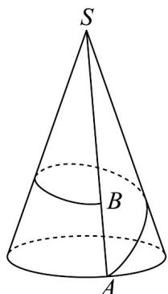

<!-- question-source:start -->
22. 如图是一座山的示意图，山呈圆锥形，圆锥的底面半径为 $^{5}$ 公里，侧棱长为 $^{20}$ 公里，B 是 SA 上一点，且 AB = 5 公里，为了发展旅游业，要建设一条最短的从 A 绕山一周到 B 的观光铁路，这条铁路从 A 出发后首先上坡，随后下坡，则下坡段铁路的长度为 \_\_\_\_ 公里

<!-- question-source:end -->

![[高中/课堂同步/题库/人教A版高中数学同步讲义(2026)/02_必修第二册/期中专项训练+期中模拟卷/专题11 基本立体图-柱体、椎体、台体（高效培优期中专项训练）数学人教A版高一必修第二册/考点02_柱体截面相关计算/questions/answers/Q00077145A1.md]]
