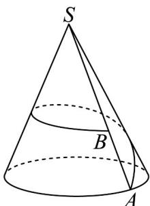

<!-- question-source:start -->
24. 如图，这是一座山的示意图，山大致呈圆锥形，山脚呈圆形，半径为 $3\mathrm{km}$ ，山高为 $3\sqrt{15}\mathrm{km}, B$ 是山坡

SA 上一点，且 AB = 7km．现要建设一条从 A 到 B 的环山观光公路，这条公路从 A 出发后先上坡，后下坡，当公路长度最短时，公路上坡路段长为（）

A · 10.2km B · 12km C · $\frac{25}{13}$ km D · $\frac{144}{13}$ km
<!-- question-source:end -->

![[高中/课堂同步/题库/人教A版高中数学同步讲义(2026)/02_必修第二册/期中专项训练+期中模拟卷/专题11 基本立体图-柱体、椎体、台体（高效培优期中专项训练）数学人教A版高一必修第二册/考点02_柱体截面相关计算/questions/answers/Q00077147A1.md]]
