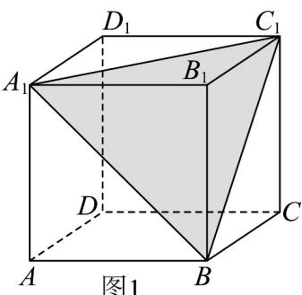
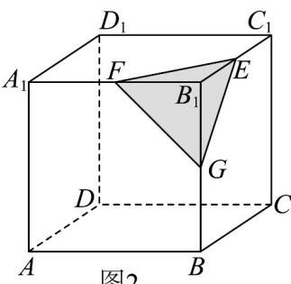

> [!faq]- 《专题11 基本立体图-柱体、椎体、台体（高效培优期中专项训练）数学人教A版高一必修第二册》官方解析
>
> > [!success]- **【答案】** A. 等腰三角形 B. 等边三角形 C. 锐角三角形 D. 直角三角形
>
> > [!note]- **【解析】**
> > 如图 $^{1}$ ，在正方体 $ABCD-A_{1}B_{1}C_{1}D_{1}$ 中，
> >
> > 易知 $VA_{1}BC_{1}$ 为正三角形，于是答案 A, B, C 都有可能，
> >
> > 
> >
> > 如图2，
> >
> > 
> >
> > 若 $\triangle EFG$ 为直角三角形，根据正方体的对称性，不妨假设 $EF\perp FG$
> >
> > 由正方体的性质可知： $GB_{1}\perp EF$ ， $GB_{1}\cap FG = G$ ，所以 $EF\bot$ 平面 $ABB_{1}A_{1}$
> >
> > 而 $EB_{1} \perp$ 平面 $ABB_{1}A_{1}$ ，于是过同一点作出了一个平面的两条垂线，显然不成立，D错误
> >
> > 故选：D.
> >
> > 考点 03 棱柱及其相关计算
