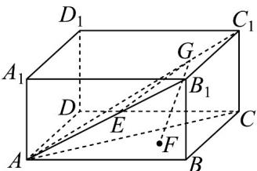
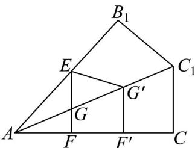

> [!faq]- 《专题11 基本立体图-柱体、椎体、台体（高效培优期中专项训练）数学人教A版高一必修第二册》官方解析
>
> > [!success]- **【答案】** $\frac{3}{4}/0.75$
>
> > [!note]- **【解析】**
> > 如图，
> >
> > 
> >
> > 显然当 $F$ 是 $G$ 在底面ABCD的射影时， $GE + GF$ 才可能最小。将平面 $AB_{1}C_{1}$ 沿 $AC_{1}$ 翻折，使其与平面 $ACC_{1}$ 共面，如图所示，
> >
> > 
> >
> > 由于 $\frac{\sqrt{2}}{2}AB = AD = AA_{1} = 1$ ，则 $B_{1}C_{1} = 1, AB_{1} = \sqrt{3}$ ，则 $\tan \angle B_{1}AC_{1} = \frac{\sqrt{3}}{3}$ ，
> >
> > 得 $\angle B_{1}AC_{1} = 30^{\circ}$ ，同理， $\angle CAC_{1} = 30^{\circ}$ ，而 $AE = \frac{1}{2} AB_{1} = \frac{\sqrt{3}}{2}$
> >
> > 显然当 $E$ ， $G$ ， $F$ 三点共线且 $GF\perp AC$ 时， $GE + GF$ 取得最小值，
> >
> > 此时， $\left(GE + GF\right)_{\min} = AE\sin \angle CAB_1 = \frac{\sqrt{3}}{2}\sin 60^{\circ} = \frac{3}{4}$
> >
> > 故答案为： $\frac{3}{4}$
