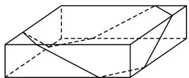
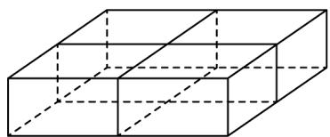

> [!faq]- 《专题11 基本立体图-柱体、椎体、台体（高效培优期中专项训练）数学人教A版高一必修第二册》官方解析
>
> > [!success]- **【答案】**  ①  ② A. $\frac{\sqrt{2} + \sqrt{5}}{5}$ B. $\frac{1 + \sqrt{6}}{5}$ C. $\frac{2 + \sqrt{3}}{5}$ D. $\frac{1 + \sqrt{5}}{5}$
>
> > [!note]- **【解析】**
> > 由题意，不防设长方体礼物盒的长、宽、高分别为 $4,4,1$ ，则方式①中包装绳长为 $4\sqrt{1^2 + 1^2} + 4\sqrt{2^2 + 1^2} = 4\sqrt{2} + 4\sqrt{5}$ ，方式②中包装绳长为 $4 \times 1 + 4 \times 4 = 20$ ，所以使用方式①与使用方式②所需的包装绳长之比为 $\frac{4\sqrt{2} + 4\sqrt{5}}{20} = \frac{\sqrt{2} + \sqrt{5}}{5}$ .
> >
> > 故选 **A**
