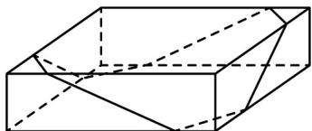
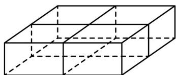

> [!faq]- 《专题11 基本立体图-柱体、椎体、台体（高效培优期中专项训练）数学人教A版高一必修第二册》官方解析
>
> > [!success]- **【答案】**   ① ② A. $\frac{\sqrt{2} + \sqrt{5}}{5}$ B. $\frac{1 + \sqrt{6}}{5}$ C. $\frac{2 + \sqrt{3}}{5}$ D. $\frac{1 + \sqrt{5}}{5}$
>
> > [!note]- **【解析】**
> > 不妨设长方体礼物盒的长、宽、高分别为 $4a(a > 0)$ 、 $4a$ 、 $a$ ，由于方式①中包装绳与礼物盒棱的交点均为棱的四等分点，所以方式①中包装绳长为 $4 \times \sqrt{a^2 + a^2} + 4 \times \sqrt{a^2 + (2a)^2} = 4(\sqrt{2} + \sqrt{5})a$ ；由于方式②中包装绳与礼物盒棱的交点均为棱的中点，所以方式②中包装绳长为 $4 \times a + 4 \times 4a = 20a$ ，所以使用方式①与使用方式②所需的包装绳长之比为 $\frac{4(\sqrt{2} + \sqrt{5})a}{20a} = \frac{\sqrt{2} + \sqrt{5}}{5}$ .
> >
> > 故选 **A**
