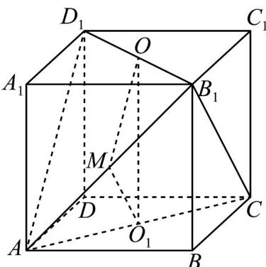

> [!faq]- 《专题11 基本立体图-柱体、椎体、台体（高效培优期中专项训练）数学人教A版高一必修第二册》官方解析
>
> > [!success]- **【答案】** B
>
> > [!note]- **【解析】**
> > 如图所示，取 $AB_{1}$ 的中点 $M$ ，连接 $OM$ ， $O_{1}M$ ， $OO_{1}$
> >
> > 由已知得 $OM // AD_{1}$ ， $OM = \frac{1}{2} AD_{1}$ ，且 $O_{1}M // B_{1}C$ ， $O_{1}M = \frac{1}{2} B_{1}C$
> >
> > 又根据三角形的三边关系知 $O_{1}M + OM > OO_{1}$ ，又 $O_{1}M + OM = \frac{1}{2}\left(B_{1}C + AD_{1}\right)$
> >
> > 所以 $\frac{1}{2}\left(B_1C + AD_1\right) > OO_1$
> >
> > 故 $2OO_{1}<AD_{1}+B_{1}C.$
> >
> > 故选：B.
> >
> > 
