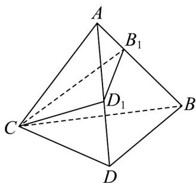
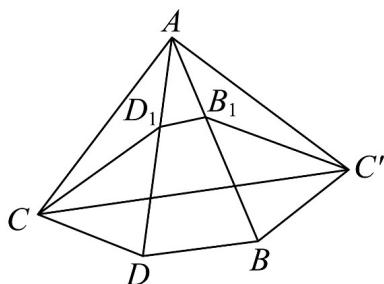

> [!faq]- 《专题11 基本立体图-柱体、椎体、台体（高效培优期中专项训练）数学人教A版高一必修第二册》官方解析
>
> > [!success]- **【答案】**  A. $4\sqrt{3}$ B.4 C. $4\sqrt{2}$ D. $2\sqrt{3}$
>
> > [!note]- **【解析】**
> > 根据题意，把正三棱锥 A-BCD 侧面沿 AC 展开，
> >
> > 
> >
> > 所以 $\triangle CB_{1}D_{1}$ 的周长为 $C_{\triangle CB_{1}D_{1}} = CD_{1} + D_{1}B_{1} + B_{1}C' \quad CC'$ 在正三棱锥 A - BCD 中， $\angle BAD = 30^{\circ}$ ，侧棱长为 $^{4}$ ，
> > 所以 $\angle CAC' = \angle CAD + \angle DAB + \angle BAC' = 3 \times 30^{\circ} = 90^{\circ}$ $CC'=\sqrt{AC^{2}+AC'^{2}}=4\sqrt{2},\quad C_{\triangle CB_{1}D_{1}}\quad4\sqrt{2}$
> >
> > 故选 **C**.
