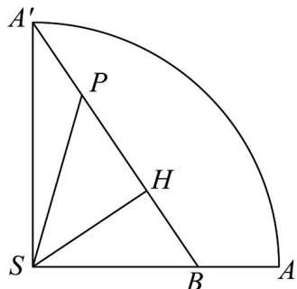

> [!faq]- 《专题11 基本立体图-柱体、椎体、台体（高效培优期中专项训练）数学人教A版高一必修第二册》官方解析
>
> > [!success]- **【答案】** 9
>
> > [!note]- **【解析】**
> > 沿母线 SA 将圆锥的侧面展开，如图：
> >
> > 
> >
> > 记 $P$ 为 $A'B$ 上的任意一点，作 $SH \perp A'B$ ，垂足为 $H$ ，连接 $SP$
> >
> > 因为 $\mathbb{A}^{\prime}A$ 的长为 $10\pi$ ，所以 $\angle A^{\prime}SA = \frac{10\pi}{20} = \frac{\pi}{2}$
> >
> > 由两点之间线段最短，知观光铁路为图中的 $A^{\prime}B$ ，
> >
> > 易知 $SB = 20 - 5 = 15$ ，所以 $A'B = \sqrt{A'S^2 + SB^2} = \sqrt{20^2 + 15^2} = 25$
> >
> > 上坡即 P 到山顶 S 的距离 PS 越来越小，下坡即 P 到山顶 S 的距离 PS 越来越大，
> > ∴下坡段的铁路，即图中的 BH ，
> >
> > 因为 $Rt\triangle SA'B \sim Rt\triangle HSB$ ，所以 $HB = \frac{SB^2}{A'B} = \frac{15^2}{25} = 9$ .
> >
> > 故答案为：9
