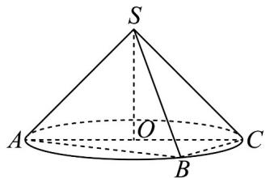
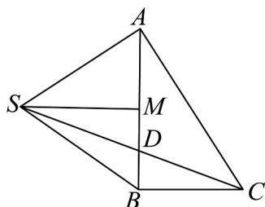

> [!faq]- 《专题11 基本立体图-柱体、椎体、台体（高效培优期中专项训练）数学人教A版高一必修第二册》官方解析
>
> > [!success]- **【答案】**  A. $\sqrt{5} + 1$ B. $\sqrt{5} - 1$ C. $\frac{\sqrt{5} + 1}{2}$ D. $\frac{\sqrt{5} - 1}{2}$
>
> > [!note]- **【解析】**
> > 由题意可知： $AB\bot BC,AC = 2\sqrt{2},BC = \sqrt{2},AB = \sqrt{6},SA = SB = 2$
> >
> > 将 $\triangle ABC, \triangle SAB$ 绕 $AB$ 旋转至同一平面，如图所示，
> >
> > 
> >
> > 可知：当且仅当 S, D, C 三点共线时， $SD + DC$ 取到最小值，
> >
> > 取 $AB$ 的中点 $M$ ，可知 $SM \perp AB$
> >
> > 可得 $SM = \sqrt{SB^2 - \left(\frac{AB}{2}\right)^2} = \frac{\sqrt{10}}{2}$ ， $\sin \angle SBA = \frac{SM}{SB} = \frac{\sqrt{10}}{4}$
> >
> > $$
> > \cos \angle S B C = \cos \left(\frac {\pi}{2} + \angle S B A\right) = - \sin \angle S B A = - \frac {\sqrt {1 0}}{4}
> > $$
> >
> > 在 $\triangle SBC$ 中，由余弦定理可得 $SC^2 = SB^2 + BC^2 - 2SB \cdot BC \cos \angle SBC = 6 + 2\sqrt{5}$
> >
> > 即 $SC = \sqrt{5} + 1$ ，所以 $SD + DC$ 的最小值为 $\sqrt{5} + 1$ 。
> >
> > 故选 **A**.
