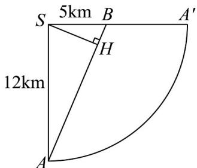

> [!faq]- 《专题11 基本立体图-柱体、椎体、台体（高效培优期中专项训练）数学人教A版高一必修第二册》官方解析
>
> > [!success]- **【答案】** D
>
> > [!note]- **【解析】**
> > 依题意，半径为 $3\mathrm{km}$ ，山高为 $3\sqrt{15}\mathrm{km}$ ，则母线 $SA = \sqrt{3^2 + (3\sqrt{15})^2} = 12$ ，底面圆周长 $2\pi r = 6\pi$ ，则圆锥侧面展开图扇形的圆心角 $\alpha = \frac{6\pi}{12} = \frac{\pi}{2}$ ，
> >
> > 
> >
> > 显然 $AB = \sqrt{12^2 + 5^2} = 13$
> >
> > 由点 S 向 AB 引垂线，垂足为点 H，此时 SH 为点 S 和线段 AB 上的点连线的最小值，即点 H 为公路的最高点，AH 段为上坡路段，HB 段为下坡路段，
> > 由直角三角形射影定理知 $SA^{2} = AH \cdot AB$ ，即 $12^{2} = 13AH$ ，解得 $AH = \frac{144}{13} km$ ，
> > 所以公路上坡路段长为 $\frac{144}{13}km$ .
> >
> > 故选 **D**
