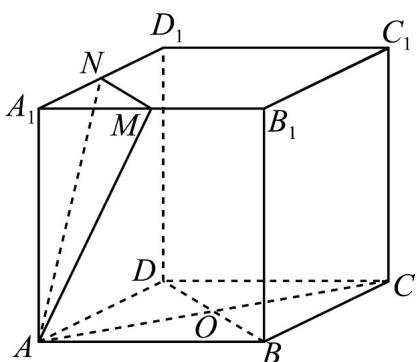
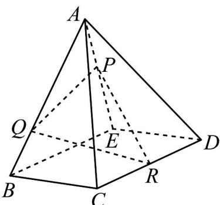

<!-- question-source:start -->
29. (1) 如图，棱长为 2 的正方体 $ABCD - A_1B_1C_1D_1$ 中， $M$ ， $N$ 是棱 $A_1B_1$ ， $A_1D_1$ 的中点，在图中画出过底面 $ABCD$ 中的心 $O$ 且与平面 $AMN$ 平行的平面在正方体中的截面，并求出截面多边形的周长为：——；

(2) 作出平面 $PQR$ 与四棱锥 $ABCDE$ 的截面，截面多边形的边数为——.

<!-- question-source:end -->

![[高中/课堂同步/题库/人教A版高中数学同步讲义(2026)/02_必修第二册/期中专项训练+期中模拟卷/专题11 基本立体图-柱体、椎体、台体（高效培优期中专项训练）数学人教A版高一必修第二册/考点05锥体截面相关计算/questions/answers/Q00077152A1.md]]
