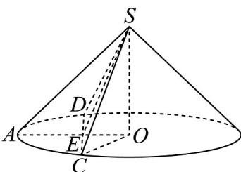

> [!faq]- 《专题11 基本立体图-柱体、椎体、台体（高效培优期中专项训练）数学人教A版高一必修第二册》官方解析
>
> > [!success]- **【答案】** A. 1 B. $\sqrt{3}$ C. 2 D. $2\sqrt{2}$
>
> > [!note]- **【解析】**
> > 因为圆锥的高是1，母线长是2，则底面半径 $r=\sqrt{2^{2}-1}=\sqrt{3}$ ，
> > 设过圆锥顶点的平面 SCD 与圆锥底面交于 CD，过底面中心 O 作 $OA^{\perp}CD$ 于 E，
> >
> > 
> >
> > 设 $CD = 2a,0 < a\leq \sqrt{3}$
> >
> > 则 $OE = \sqrt{r^2 - a^2} = \sqrt{3 - a^2}$ ， $SE = \sqrt{OS^2 + OE^2} = \sqrt{4 - a^2}$
> >
> > 可得截面 SCD 的面积 $S = \frac{1}{2} CD \times SE = \frac{1}{2} \times 2a\sqrt{4 - a^{2}} = \sqrt{a^{2}(4 - a^{2})} \leq \frac{a^{2} + 4 - a^{2}}{2} = 2$ ，
> > 当且仅当 $a^{2}=4-a^{2}$ ，即 $a=\sqrt{2}$ 时等号成立，
> > 所以截面积的最大值为2.
> >
> > 故选 **C**.
