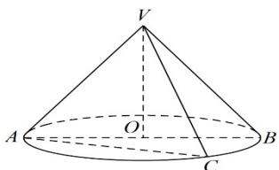

> [!faq]- 《专题11 基本立体图-柱体、椎体、台体（高效培优期中专项训练）数学人教A版高一必修第二册》官方解析
>
> > [!success]- **【答案】** A. 4 B. 6 C. $\frac{8\sqrt{2}}{3}$ D. $4\sqrt{2}$
>
> > [!note]- **【解析】**
> > 如图，VA, VB, VC 为母线，O 为底面圆心，其中 $\triangle YAB$ 为轴截面三角形，则 $OB = 2\sqrt{2}$ ，VO = 2，则 $VB = \sqrt{VO^{2} + OB^{2}} = \sqrt{4 + 8} = 2\sqrt{3}$ ，
> > 则在 $\triangle YAB$ 中利用余弦定理可得， $\cos\angle BVA=\frac{VA^{2}+VB^{2}-AB^{2}}{2VA\cdot VB}=\frac{12+12-32}{2\times2\sqrt{3}\times2\sqrt{3}}=-\frac{1}{3}<0$ ，
> > 则 $\angle BVA$ 为钝角，
> > 设过圆锥任意两条母线所作的截面三角形 VAC 的顶角 DAVC = α，则 $0 < \alpha \leq \angle BVA$ 则截面三角形的面积为 $\frac{1}{2} \cdot VA \cdot VC \cdot \sin \alpha = 6 \sin \alpha$
> >
> > 则当 $\sin \alpha = 1$ ，即 $\alpha = \frac{\pi}{2}$ 时，截面三角形的面积最大，最大值为6.
> >
> > 故选：B
> >
> > 
