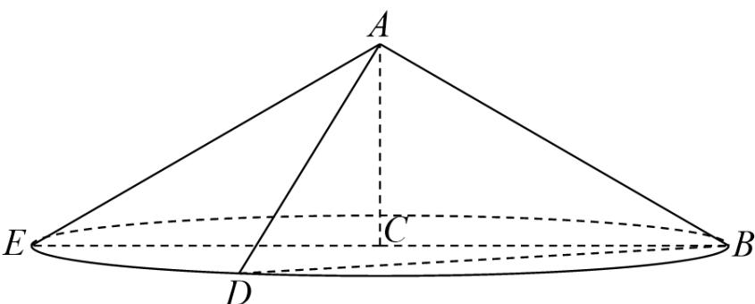

> [!faq]- 《专题11 基本立体图-柱体、椎体、台体（高效培优期中专项训练）数学人教A版高一必修第二册》官方解析
>
> > [!success]- **【答案】** D
>
> > [!note]- **【解析】**
> > 
> >
> > 如图，圆锥任意两条母线为 $AB$ 和 $AD$ ，则截面为等腰三角形ABD
> >
> > ∴截面面积为： $S_{\triangle ABD}=\frac{1}{2}AB\cdot AD\cdot\sin\angle BAD$
> >
> > 由图可知，当截面为圆锥轴截面时，∠BAD 最大，最大为 $120^{\circ}$
> >
> > $\therefore \angle BAD \in (0^{\circ}, 120^{\circ}], \therefore \sin \angle BAD$ 最大值为 $1$
> >
> > $\because AB = AD = \sqrt{AC^2 + BC^2} = \sqrt{4 + 12} = 4$ 为定值，故当 $\sin \angle BAD$ 最大时截面面积最大，
> >
> > 故截面面积最大为 $\frac{1}{2} \times 4^2 \times 1 = 8$
> >
> > 故选 **D**.
