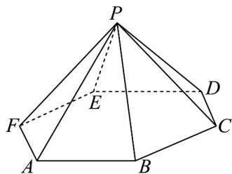
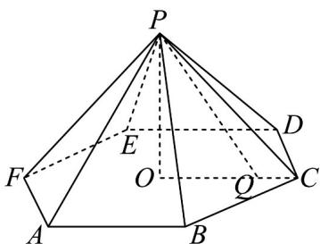
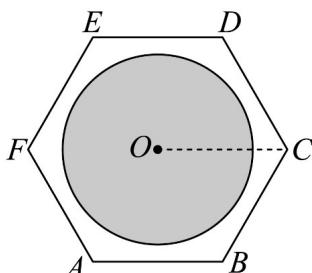
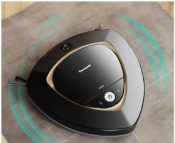
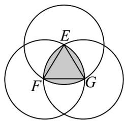
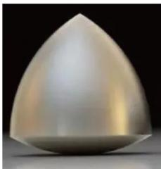
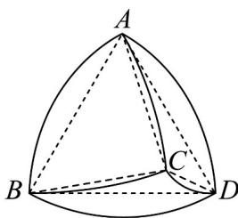
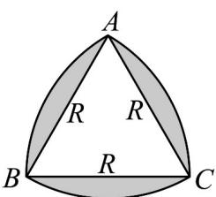
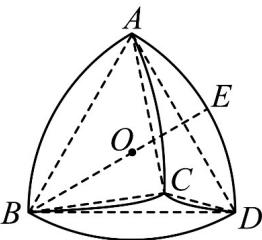
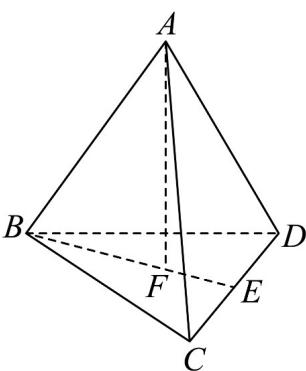

> [!faq]- 《专题11 基本立体图-柱体、椎体、台体（高效培优期中专项训练）数学人教A版高一必修第二册》官方解析
>
> > [!success]- **【答案】**  A. $4\pi$ B. $5\pi$ C. $6\pi$ D. $7\pi$
>
> > [!note]- **【解析】**
> > 因为 P-ABCDEF 为正六棱锥，则顶点 P 在底面的投影为底面中心 O，如图，
> >
> > 
> >
> > 
> >
> > 又因为底面边长为3，则 $OC = 3$ ，可得 $PO = \sqrt{PC^2 - OC^2} = 3\sqrt{3}$
> >
> > 且 $PQ \leq 4\sqrt{2}$ ，则 $OQ = \sqrt{PQ^2 - OP^2} \leq \sqrt{5}$
> >
> > 可知点 $Q$ 所形成区域为以 $O$ 为圆心，半径为 $\sqrt{5}$ 的圆面，其面积为 $\pi (\sqrt{5})^2 = 5\pi$
> >
> > 故选：B.
> >
> > 32. 图 $^{1}$ 中的扫地机器人的外形是按照如下方法设计的：先画一个正三角形 EFG，再以正三角形每个顶点为圆心，以边长为半径，在另两个顶点间作一段弧，三段弧围成的曲边三角形。德国工程师勒洛首先发现这个曲边三角形能够像圆一样当作轮子用，故称其为“勒洛三角形”。将其推广到空间，如图 $^{2}$ ，以正四面体 ABCD 的四个顶点为球心，以正四面体的校长为半径的四个球的相交部分围成的几何体叫做“勒洛四面体”。
> >
> > 则下列结论正确的是（）
> >
> > 
> > 图1
> >
> > 
> > 图2
> >
> > 
> > 图3
> >
> > 
> > 图4
> >
> > A. 若正三角形 $EFG$ 的边长为 $R$ ，则勒洛三角形面积为 $\left(\pi - \sqrt{3}\right) R^2$
> >
> > B. 若正三角形 $EFG$ 的边长为 $R$ ，则勒洛三角形的面积比正三角形 $EFG$ 的面积大 $\frac{2\pi - 3\sqrt{3}}{4} R^2$ C. 若正四面体 $ABCD$ 的棱长为 $^2$ ，则勒洛四面体能容纳的最大球的半径为 $2 - \frac{\sqrt{6}}{2}$ D. 若正四面体 $ABCD$ 的棱长为 $^2$ ，则勒洛四面体表面上交线 $AC$ 的长度小于 $\frac{\sqrt{3}}{3}\pi$
> >
> > 【答案】BC
> >
> > 【详解】A选项：由题意可知：BC = R
> >
> > 以 $B$ 为圆心的扇形面积是 $\frac{\pi}{6} R^2$ ，VABC的面积是 $\frac{1}{2}\times R\times R\times \frac{\sqrt{3}}{2} = \frac{\sqrt{3}}{4} R^2$
> >
> > 则勒洛三角形的面积为 3 个扇形面积减去 2 个正三角形面积，
> >
> > 即 $\frac{\pi}{6} R^2\times 3 - \frac{\sqrt{3}}{4} R^2\times 2 = \frac{(\pi - \sqrt{3})R^2}{2}$ ，所以A错误；
> >
> > B 选项：设圆半径为 R ，如图，
> >
> > 
> >
> > 易得 $V_{ABC}$ 的面积为 $\frac{1}{2} \times \frac{\sqrt{3}}{2} R^2 = \frac{\sqrt{3}}{4} R^2$
> >
> > 阴影部分面积为 $3 \times \frac{60\pi R^2}{360} - 3 \times \frac{\sqrt{3}}{4} R^2 = \frac{2\pi - 3\sqrt{3}}{4} R^2$ ，B 正确；
> >
> > C 选项：根据题意，勒洛四面体能够容纳的最大球与勒洛四面体的弧面相切，设点 E 为该球与勒洛四面体的一个切点，O 为该球球心，
> >
> > 
> >
> > 所以，由四面体的性质可知该球球心 $O$ 为正四面体 $ABCD$ 的中心，半径为 $OE$ ，连接 $BE$ ，则 $B$ ， $E$ ， $O$ 三点共线，此时 $BE = 2$ ， $BO$ 为正四面体的外接球的半径，由于正四面体 $ABCD$ 的棱长为 2，其可以在棱长为 $\sqrt{2}$ 的正方体中截出，所以正四面体 $ABCD$ 的外接球的半径为棱长 $\sqrt{2}$ 的正方体的外接球半径，即正方体体对角线的一半，所以 $BO = \frac{\sqrt{6}}{2}$ ，则勒洛四面体能够容纳的最大球的半径 $OE = 2 - \frac{\sqrt{6}}{2}$ ；C 正确；D 选项，由对称性可知：勒洛四面体表面上交线 $AC$ 所在圆的圆心为 $BD$ 的中点 $M$ ，故 $MA = MC = \sqrt{3}$ ，又 $AC = 2$ ，由余弦定理得： $\cos \angle AMC = \frac{AM^2 + MC^2 - AC^2}{2AM \cdot MC} = \frac{3 + 3 - 4}{2 \times \sqrt{3} \times \sqrt{3}} = \frac{1}{3} < \frac{1}{2} = \cos \frac{\pi}{3}$ ，故 $\angle AMC > \frac{\pi}{3}$ ，且半径为 $\sqrt{3}$ ，故交线 $AC$ 的长度大于 $\frac{\sqrt{3}}{3}\pi$ ，D 错误；
> >
> > 故选：BC
> >
> > 33. 将 $^{3}$ 个半径为 $^{1}$ 的球和一个半径为 $\sqrt{2}-1$ 的球叠为两层放在桌面上，上层只放一个较小的球，四个球两两相切，那么上层小球的最高点到桌面的距离是（）
> >
> > 【答案】
> >
> > A. $\frac{3\sqrt{2}+\sqrt{6}}{3}$ B. $\frac{\sqrt{3}+2\sqrt{6}}{3}$ C. $\frac{\sqrt{2}+2\sqrt{6}}{3}$ D. $\frac{2\sqrt{2}+\sqrt{6}}{3}$
> >
> > 【答案】A
> >
> > 【详解】如图所示：
> >
> > 
> >
> > 设下层三个半径为 $^{1}$ 的球的球心分别为 B，C，D，
> >
> > 上层较小的球的球心为 A，则 $\triangle BCD$ 是边长为 2 的等边三角形，
> >
> > $AB = AC = AD = \sqrt{2}$ ，过 $A$ 作平面 $BCD$ 的垂线 $AF$ ，交平面 $BCD$ 于点 $F$
> >
> > 则 $F$ 是 $\triangle BCD$ 的重心，则有 $BF = \frac{2}{3} BE = \frac{2}{3}\sqrt{4 - 1} = \frac{2\sqrt{3}}{3}$
> >
> > 所以 $AF = \sqrt{2 - \frac{4}{3}} = \frac{\sqrt{6}}{3}$
> >
> > 所以上层小球的最高点到桌面的距离为： $AF + 1 + \sqrt{2} - 1 = \frac{3\sqrt{2} + \sqrt{6}}{3}$
> >
> > 故选：A.
> >
> > 34. 埃及胡夫金字塔是古代世界建筑奇迹之一，它的形状可视为一个正四棱锥，以该四棱锥的高为边长的正方形面积等于该四棱锥侧面积的一半，那么其侧面三角形底边上的高与底面正方形的边长的比值为（）
> >
> > 【答案】
> > A. $\frac{\sqrt{2}-1}{4}$ B. $\frac{\sqrt{2}-1}{2}$ C. $\frac{\sqrt{2}+1}{4}$ D. $\frac{\sqrt{2}+1}{2}$
> >
> > 【答案】D
> >
> > 【详解】设正四棱锥的高为 h，底面边长为 a，侧面三角形底边上的高为 $h'$ ，则
> > 由题意可知， $\left\{\begin{aligned}h^{2}&=4\times\frac{1}{2}\times\frac{1}{2}ah^{\prime}\\ h^{2}&=h^{\prime2}-\left(\frac{a}{2}\right)^{2}\end{aligned}\right.$
> >
> > 因此有
> >
> > $h^{2}=h^{\prime2}-\left(\frac{a}{2}\right)^{2}=ah^{\prime}$ ，即 $\left(\frac{h^{\prime}}{a}\right)^{2}-\frac{h^{\prime}}{a}-\frac{1}{4}=0$ ，解得 $\frac{h^{\prime}}{a}=\frac{1\pm\sqrt{2}}{2}$ ，
> >
> > 因为 $\frac{h'}{a} > 0$
> >
> > 所以 $\frac{h^{\prime}}{a} = \frac{1 + \sqrt{2}}{2}$
> >
> > 所以侧面三角形底边上的高与底面正方形的边长的比值为 $\frac{\sqrt{2} + 1}{2}$
> >
> > 故选 **D**.
