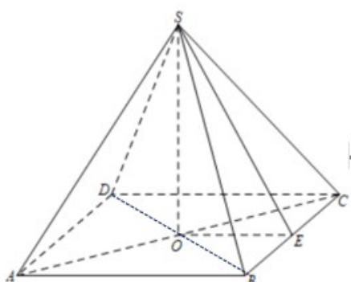

> [!faq]- 《专题11 基本立体图-柱体、椎体、台体（高效培优期中专项训练）数学人教A版高一必修第二册》官方解析
>
> > [!success]- **【答案】** 2
>
> > [!note]- **【解析】**
> > 连接正方形的对角线，并相交于点 O，取 BC 中点为 E，连接 OE, SO, SE
> >
> > 由题意知， $SO \perp AC, SO \perp BD$ ，AC, $BD \subset$ 面 ABCD， $AC \cap BD = O$
> >
> > $\therefore SO \perp$ 面 $ABCD$
> >
> > 即 $SO$ 为该四棱锥的高
> >
> > $OE \subset$ 面 $ABCD$ , 则 $\mathrm{SO} \perp \mathrm{OE}$
> >
> > 因为侧面积是 $4\sqrt{5}$ ，所以 $S_{\triangle SBC} = \frac{1}{2} \times BC \times SE = \frac{1}{2} \times 2 \times SE = \frac{4\sqrt{5}}{4}$ ，即 $SE = \sqrt{5}$
> >
> > 所以 $SO = \sqrt{SE^2 - OE^2} = \sqrt{5 - 1} = 2$
> >
> > 故答案为：2
> >
> > 
> >
> > 36. 正三棱锥底面边长为 $a$ ，高为 $\frac{\sqrt{6}}{6} a$ ，则此正三棱锥的侧面积为（）
> >
> > 【答案】
> >
> > A. $\frac{3}{4} a^2$ B. $\frac{3}{2} a^2$ C. $\frac{3\sqrt{3}}{4} a^2$ D. $\frac{3\sqrt{3}}{2} a^2$
> >
> > 【答案】A
> >
> > 【详解】因为底面正三角形中高为 $\frac{\sqrt{3}}{2} a$ ，其重心到顶点距离为 $\frac{\sqrt{3}}{2} a \times \frac{2}{3} = \frac{\sqrt{3}}{3} a$ ，且棱锥高 $\frac{\sqrt{6}}{6} a$ ，所以利用直角三角形勾股定理可得侧棱长为 $\sqrt{\frac{a\sqrt{6}}{6}a\frac{\ddot{Q}^2}{\ddot{Q}} + \frac{a\sqrt{3}}{3}a\frac{\ddot{Q}^2}{\ddot{Q}}} = \frac{\sqrt{2}}{2} a$ ，斜高为 $\sqrt{\frac{a\sqrt{2}}{2}a\frac{\ddot{Q}^2}{\ddot{Q}} - \frac{a\ddot{Q}}{2}a\frac{\ddot{Q}^2}{\ddot{Q}}} = \frac{a}{2}$ ，所以侧面积为 $S = 3'$ $\frac{1}{2} a'$ $\frac{1}{2} a = \frac{3}{4} a^2$ 。选A.
