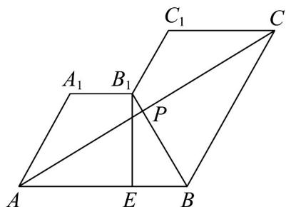

> [!faq]- 《专题11 基本立体图-柱体、椎体、台体（高效培优期中专项训练）数学人教A版高一必修第二册》官方解析
>
> > [!success]- **【答案】** B
>
> > [!note]- **【解析】**
> > 把四边形 $A_{1}ABB_{1}$ , $BB_{1}C_{1}C$ 展开至同一个平面，连接 $AC$ , $AC_{1}$ , $AB_{1}$ ，过点 $B_{1}$ 作 $B_{1}E \perp AB$ ，则 $BE = 2$ ，又 $BB_{1} = AA_{1} = 4$ ，则 $\angle ABB_{1} = 60^{\circ}$ ，在 VABC 中， $AB = BC = 6$ ， $\angle ABC = 120^{\circ}$ ，则 $AC = 2 \times 6 \times \frac{\sqrt{3}}{2} = 6\sqrt{3}$ ，此时线段 $AC$ 中点到点 $B$ 的距离 $AB\cos 60^{\circ} = 3 < 4 = BB_{1}$ ，即线段 $AC$ 与 $BB_{1}$ 相交，因此 $AP + PC$ 的最小值就是展开图中 $AC$ 的长，点 $P$ 为 $AC$ 与 $BB_{1}$ 的交点，所以 $AP + PC$ 的最小值为 $6\sqrt{3}$ .
> >
> > 故选：B
> >
> > 
