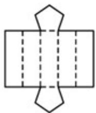
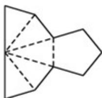
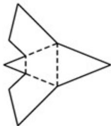
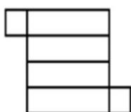
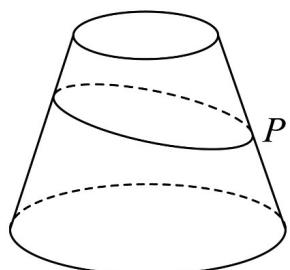
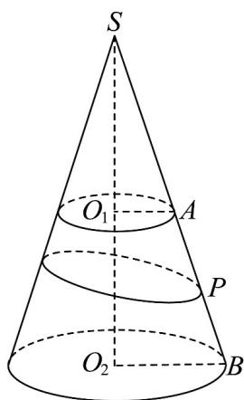
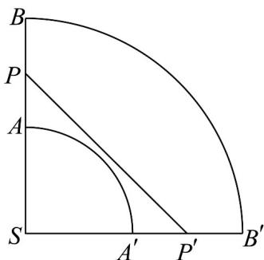

> [!faq]- 《专题11 基本立体图-柱体、椎体、台体（高效培优期中专项训练）数学人教A版高一必修第二册》官方解析
>
> > [!success]- **【答案】** A  B  C  D 
>
> > [!note]- **【解析】**
> > 对于 A 选项，图形沿着折线翻折起来是一个五棱柱，故 A 选项不正确；
> > 对于 B 选项，图形沿着折线翻折起来是一个五棱锥，故 B 选项正确；
> > 对于 C 选项，图形沿着折线翻折起来是一个三棱台，故 C 选项不正确；
> > 对于 D 选项，图形沿着折线翻折起来是一个四棱柱，故 D 选项不正确；
> >
> > 41. 圆台的上底面半径为 $^{1}$ ，下底面半径为 $^{2}$ ，母线长为 $^{4}$ 。已知 $P$ 为该圆台某条母线的中点，若一质点从点 $P$ 出发，绕着该圆台的侧面运动一圈后又回到点 $P$ ，则该质点运动的最短路径长为（）
> >
> > 【答案】
> >
> > 
> >
> > A $6\sqrt{2}$ B 6 C $6\pi$ D $3\pi$
> >
> > 【答案】A
> >
> > 【详解】 $P$ 为圆台母线 $AB$ 的中点， $O_{1}, O_{2}$ 分别为上下底面的圆心，把圆台扩成圆锥，如图所示，
> >
> > 
> >
> > 则 $O_{1}A=1$ ， $O_{2}B=2$ ，AB=4，
> >
> > 由 $O_{1}A//O_{2}B$ ，有 $SA = 4$ ， $SB = 8$ ， $SP = 6$
> >
> > 圆锥底面半径 $O_{2}B=2$ ，底面圆的周长为 $4\pi$ ，母线长 SB=8，
> >
> > 所以侧面展开图的扇形的圆心角为 $\frac{4\pi}{8} = \frac{\pi}{2}$ ，即 $\angle BSB' = \frac{\pi}{2}$ ，如图所示，
> >
> > 
> >
> > 质点从点 $P$ 出发，绕着该圆台的侧面运动一圈后又回到点 $P$ ，则运动的最短路径为展开图弦 $PP'$ ， $\angle PSP' = \frac{\pi}{2}$ ， $SP = SP' = 6$ ，有 $PP' = 6\sqrt{2}$ 。
> >
> > 故选 **A**
