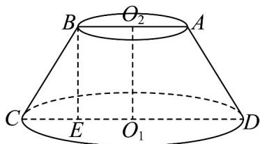
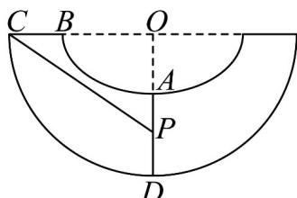
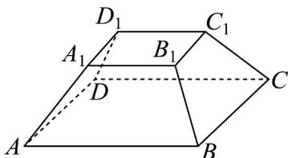
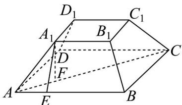

> [!faq]- 《专题11 基本立体图-柱体、椎体、台体（高效培优期中专项训练）数学人教A版高一必修第二册》官方解析
>
> > [!success]- **【答案】** (1) $2\sqrt{3}$ cm； (2) $12\sqrt{3}cm^{2}$ (3)10cm
>
> > [!note]- **【解析】**
> > （1）如图1，作 $BE \perp CD$ 交CD于E
> >
> > 
> > 图1
> >
> > 易得 $CE = \frac{CD - AB}{2} = 2\mathrm{cm}$
> >
> > 则 $O_{1}O_{2} = BE = \sqrt{4^{2} - 2^{2}} = 2\sqrt{3}\mathrm{cm}$ ，则圆台的高为 $2\sqrt{3}\mathrm{cm}$
> >
> > (2) 圆台的轴截面面积为： $\frac{1}{2}\times(4+8)\times2\sqrt{3}=12\sqrt{3}cm^{2}$
> >
> > (3) 把圆台补成圆锥可得大圆锥的母线长为 $8 \mathrm{~cm}$ , 底面半径为 $4 \mathrm{~cm}$
> >
> > 圆锥侧面展开图的圆心角为 $\theta = \frac{2\pi \times 4}{8} = \pi$
> >
> > 设 $AD$ 的中点为 $P$ ，连接 $CP$ （如图2）
> >
> > 
> > 图2
> >
> > 可得 $\angle COP = \frac{\pi}{2}, OC = 8\mathrm{cm}, OP = 4 + 2 = 6(\mathrm{cm})$
> >
> > 则 $CP = \sqrt{6^2 + 8^2} = 10\mathrm{cm}$
> >
> > 所以沿着该圆台表面从点 C 到 AD 中点的最短距离为 10cm .
> >
> > 考点 08 棱台及其相关计算
> >
> > 43. 将一个正四棱台物件放入有一定深度的电解槽中，对其表面进行电泳涂装·如图所示，已知该物件的上底边长与侧棱长相等，且为下底边长的一半，一个侧面的面积为 $3\sqrt{3}$ ，则该物件的高为\_\_\_\_。
> >
> > 【答案】
> >
> > 
> >
> > 【答案】 $\sqrt{2} / 2^{\frac{1}{2}}$
> >
> > 【详解】设 $A_{1}B_{1}=BB_{1}=a$ ，则 AB=2a，
> >
> > 因为该四棱台为正四棱台，所以各个侧面都为等腰梯形，上、下底面为正方形，
> >
> > 
> >
> > 在四边形 $ABB_{1}A_{1}$ 中，过点 $A_{1}$ 作 $A_{1}E \perp AB$ 于点 E ，
> >
> > 则 $AE = \frac{1}{2}(2a - a) = \frac{a}{2}$ ，所以 $A_{1}E = \frac{\sqrt{3}}{2} a$
> >
> > 所以 $S_{ABB_1A_1} = \frac{a + 2a}{2}\cdot \frac{\sqrt{3}}{2} a = \frac{3\sqrt{3}}{4} a^2 = 3\sqrt{3}$ ，解得 $a = 2$
> >
> > 在平面 $ACC_{1}A_{1}$ 中，过点 $A_{1}$ 作 $A_{1}F \perp AC$ 于点 F ，
> >
> > 易知 $A_{1}F$ 为正四棱台的高，则 $AF = \frac{AC - A_1C_1}{2} = \frac{1}{2}\left(4\sqrt{2} - 2\sqrt{2}\right) = \sqrt{2}$ ，
> >
> > 所以 $A_{1}F = \sqrt{A_{1}A^{2} - AF^{2}} = \sqrt{4 - 2} = \sqrt{2}$
> >
> > 则该物件的高为 $\sqrt{2}$
> >
> > 故答案为： $\sqrt{2}$
