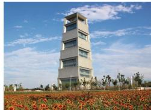
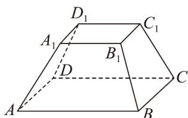
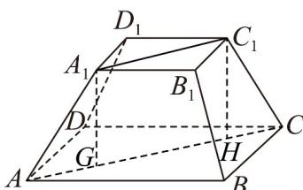
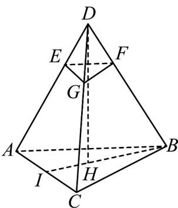

> [!faq]- 《专题11 基本立体图-柱体、椎体、台体（高效培优期中专项训练）数学人教A版高一必修第二册》官方解析
>
> > [!success]- **【答案】**  图1  图2
>
> > [!note]- **【解析】**
> > 由 $ABCD - A_{1}B_{1}C_{1}D_{1}$ 为正四棱台， $AB = 4\sqrt{2}$ ， $A_{1}B_{1} = 2\sqrt{2}$ ， $AA_{1} = \sqrt{6}$ ，
> > 连接 AC， $A_{1}C_{1}$ 得 AC = 8， $A_{1}C_{1} = 4$ 过 $A_{1}$ 作 $A_{1}G \perp AC$ ，过 $C_{1}$ 作 $C_{1}H \perp AC$ ，
> > 所以 $A_{1}C_{1}=GH=4$ ，AG=HC=2，
> > 在直角三角形 $AA_{1}G$ 中， $A_{1}G=\sqrt{(AA_{1})^{2}-(AG)^{2}}=\sqrt{(\sqrt{6})^{2}-2^{2}}=\sqrt{2}$ 所以正四棱台的高 $h=\sqrt{2}$ 故答案为： $\sqrt{2}$
> >
> > 
> >
> > 45. 所有棱长均为 $^{6}$ 的正三棱锥被平行于其底面的平面所截，截去一个底面边长为 $^{2}$ 的正三棱锥，则所得棱台的高为（）A. $\frac{4\sqrt{6}}{3}$ B. $\frac{2\sqrt{6}}{3}$ C. $\sqrt{6}$ D. $\frac{\sqrt{6}}{2}$
> >
> > 【答案】A 【详解】
> >
> > 
> >
> > 如图，根据题意可得所得棱台为正三棱台，
> >
> > 该棱台的高等于大正三棱锥的高的 $\frac{2}{3}$
> >
> > 设大正三棱锥的高为 $DH$ ，则： $BH = \frac{2}{3} BI = \frac{2}{3}\times 3\sqrt{3} = 2\sqrt{3}$
> >
> > 因为大正三棱锥的高为： $DH = \sqrt{DB^2 - BH^2} = \sqrt{6^2 - (2\sqrt{3})^2} = 2\sqrt{6}$
> >
> > 所以该棱台的高为 $\frac{2}{3}\times2\sqrt{6}=\frac{4\sqrt{6}}{3}$ .
> >
> > 故选 **A**
