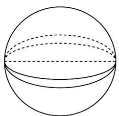
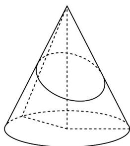
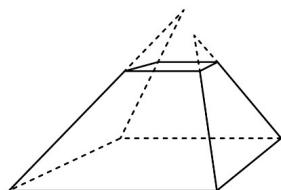

> [!faq]- 《专题12 基本立体图-球、简单几何体（高效培优期中专项训练）数学人教A版高一必修第二册》官方解析
>
> > [!success]- **【答案】** C
>
> > [!note]- **【解析】**
> > 对于 $^{A}$ 选项：当球面上两点与球心在一条直线上时，这样的平面有无数多个，如下图：
> >
> > 
> >
> > 对于 $^{B}$ 选项：若平面与圆锥底面不平行，则此时截出来的不是圆台·如下图：
> >
> > 
> >
> > 对于 $C$ 选项：由正棱锥的定义与性质知，正棱锥的所有侧棱均相等，底面是正多边形，所以侧面是全等的等腰三角形；
> >
> > 对于 $^{D}$ 选项：棱台要求侧棱的延长线交于一点，反例如下：
> >
> > 
> >
> > 故选 **C**.
