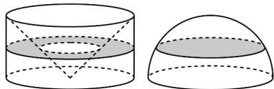
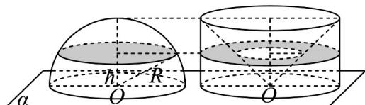

> [!faq]- 《专题12 基本立体图-球、简单几何体（高效培优期中专项训练）数学人教A版高一必修第二册》官方解析
>
> > [!success]- **【答案】**  A. $S_{1} < S_{2}$ B. $S_{1} = S_{2}$ C. $S_{1} > S_{2}$ D. $S_{1}$ 与 $S_{2}$ 的大小关系不确定
>
> > [!note]- **【解析】**
> > 设截面与圆柱底面的距离为 $h$
> >
> > 
> >
> > 该平面截半球所得圆面的半径为 $\sqrt{R^2 - h^2}$ ，圆的面积为 $S_{2} = \pi (R^{2} - h^{2})$
> >
> > 由于圆柱的底面半径与高相等，所以，圆环的内圆半径为 $h$
> >
> > 所以，圆环的面积为 $S_{1} = \pi (R^{2} - h^{2})$ ，故 $S_{1} = S_{2}$
> >
> > 故选 **B**.
