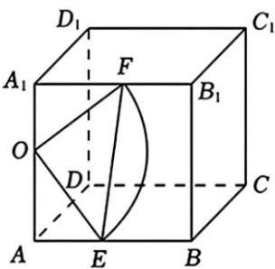

> [!faq]- 《专题12 基本立体图-球、简单几何体（高效培优期中专项训练）数学人教A版高一必修第二册》官方解析
>
> > [!success]- **【答案】** $\frac{17\pi}{2}$
>
> > [!note]- **【解析】**
> > 依题意，因为 $OA = 4$ ， $AA_{1} = AB = A_{1}B_{1} = 7$
> >
> > 故在 $AB, A_1B_1$ 上必存在点 $E, F$ 满足 $OE = OF = 5$ ，如图所示。 $\begin{aligned} & AE = \sqrt{OE^2 - OA^2} = 3 = OA_1 \\ & \text{所以}^\triangle AEO \cong \triangle A_1OF \end{aligned}$ ，所以 $\angle AEO = \angle A_1OF$ ，又因为 $\angle AEO + \angle AOE = \frac{\pi}{2}$ ，所以 $\angle A_1OF + \angle AOE = \frac{\pi}{2}$ ，所以 $\angle EOF = \pi - (\angle A_1OF + \angle AOE) = \frac{\pi}{2}$ ，即 $OE \perp OF$ 。在平面 $AA_1B_1B$ 内满足条件的点的轨迹为 $EF$ ，该轨迹是以 $5$ 为半径的 $\frac{1}{4}$ 个圆周，所以长度为 $2\pi \times 5 \times \frac{1}{4} = \frac{5\pi}{2}$ ；同理，在平面 $AA_1D_1D$ 内满足条件的点轨迹长度为 $\frac{5\pi}{2}$ ；在平面 $A_1B_1C_1D_1$ 内满足条件的点的轨迹为以 $A_1$ 为圆心， $A_1F$ 为半径的圆弧，长度为 $2\pi \times 4 \times \frac{1}{4} = 2\pi$ ；同理，在平面 $ABCD$ 内满足条件的点的轨迹为以 $A$ 为圆心， $AE$ 为半径的圆弧，长度为 $2\pi \times 3 \times \frac{1}{4} = \frac{3\pi}{2}$ 。故轨迹的总长度为 $\frac{5\pi}{2} + \frac{5\pi}{2} + 2\pi + \frac{3\pi}{2} = \frac{17\pi}{2}$ 。故答案为： $\frac{17\pi}{2}$ 。
> >
> > 
