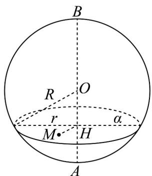

> [!faq]- 《专题12 基本立体图-球、简单几何体（高效培优期中专项训练）数学人教A版高一必修第二册》官方解析
>
> > [!success]- **【答案】** C
>
> > [!note]- **【解析】**
> > 如图，设截得的截面圆的半径为 $r$ ，球 $O$ 的半径为 $R$
> >
> > 
> >
> > 因为 $AH:HB = 1:2$
> >
> > 所以 $OH = \frac{1}{3} R \cdot$ 由勾股定理，得 $R^{2} = r^{2} + OH^{2}$ ，由题意得 $\pi r^{2} = \pi, r = 1$ ，
> >
> > 所以 $R^2 = 1 + \left(\frac{1}{3} R\right)^2$ ，解得 $R^2 = \frac{9}{8}$
> >
> > 此时过点 M 作球 O 的截面，若要所得的截面面积最小，只需所求截面圆的半径最小。
> >
> > 设球心 $O$ 到所求截面的距离为 $d$ ，所求截面的半径为 $r'$ ，则 $r' = \sqrt{R^2 - d^2}$
> >
> > 所以只需球心 O 到所求截面的距离 d 最大即可，
> >
> > 而当且仅当 $OM$ 与所求截面垂直时，球心 $O$ 到所求截面的距离 $d$ 最大，
> >
> > 即 $d_{\max} = OM = \sqrt{\left(\frac{1}{3}R\right)^{2} + MH^{2}} = \frac{1}{2}$ ，所以 $r'_{\min} = \sqrt{\frac{9}{8} - \frac{1}{4}} = \frac{\sqrt{14}}{4}$ .
> >
> > 故选 **C**
